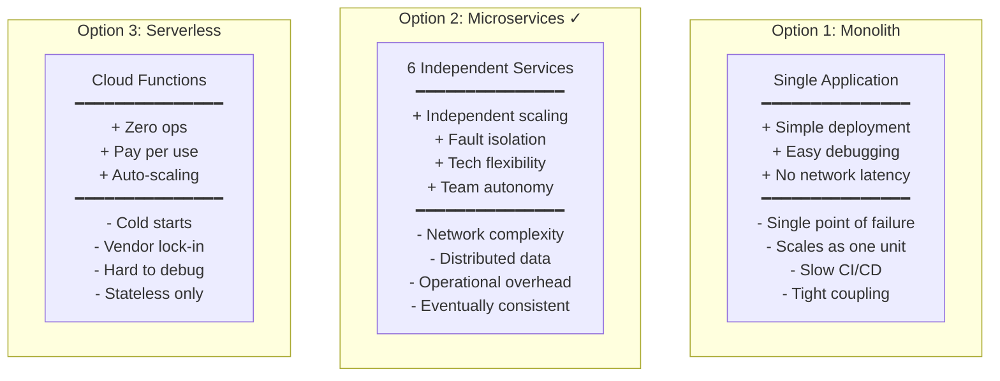
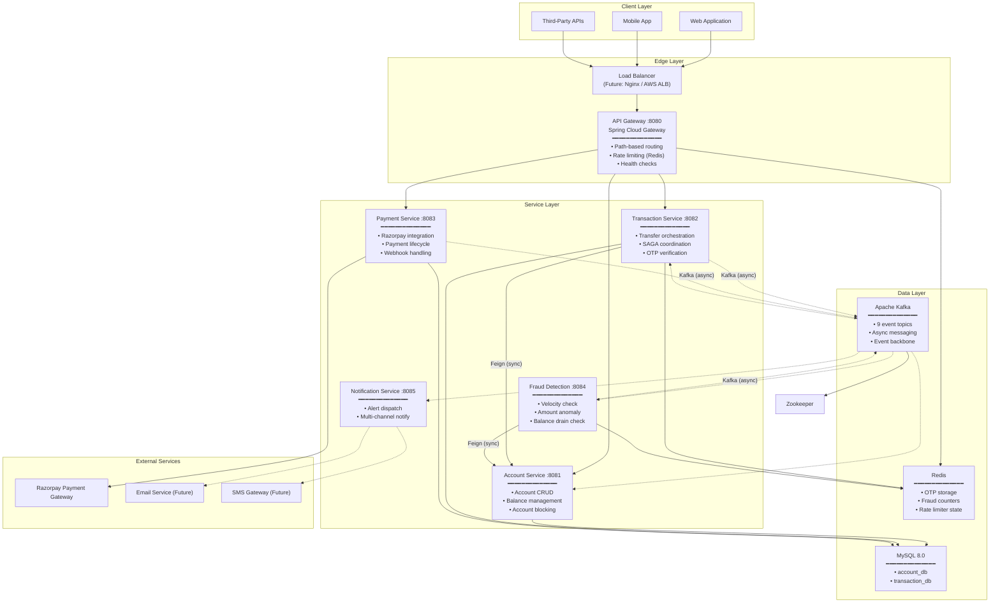
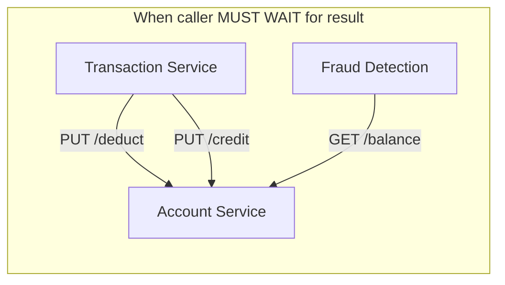
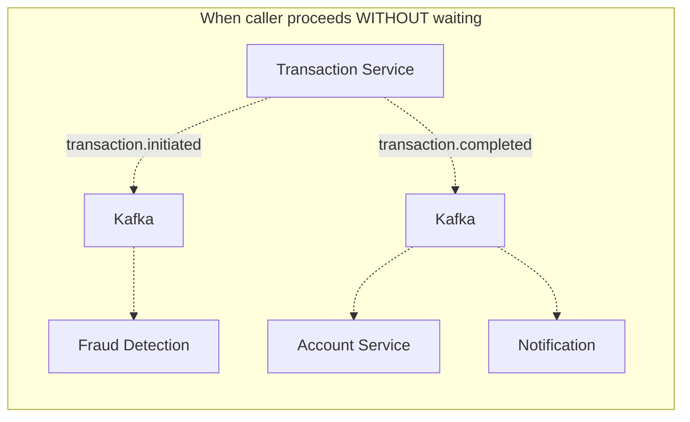
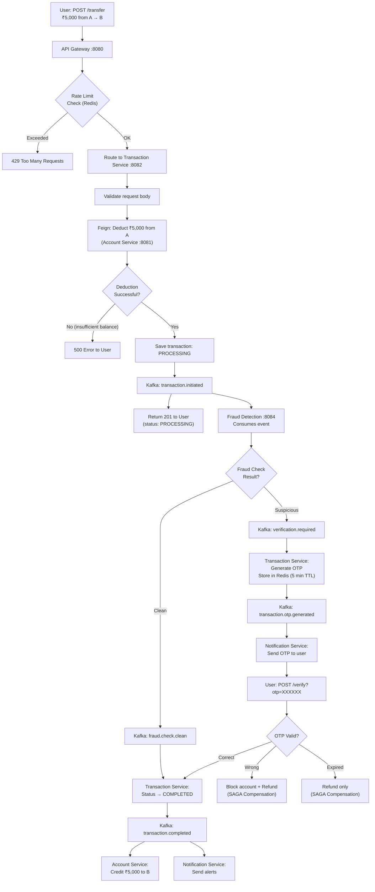
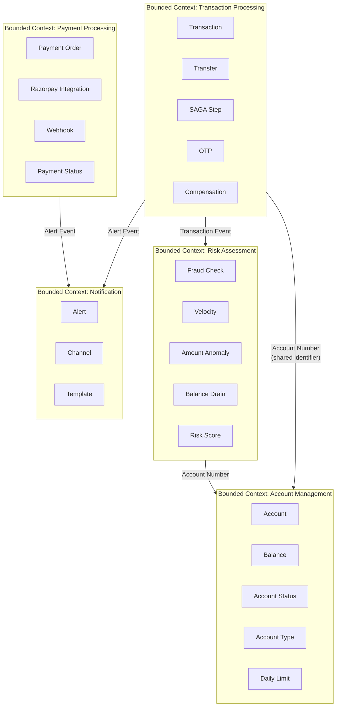

# 01 — System Architecture

## 1.1 Problem Statement

Design a **banking system** that allows users to:
- Create and manage bank accounts
- Transfer money between accounts with real-time fraud detection
- Process payments through an external payment gateway
- Receive notifications for all financial activities

### Functional Requirements

| # | Requirement | Priority |
|---|---|---|
| FR-1 | Users can create accounts (Savings, Current, Fixed Deposit) | P0 |
| FR-2 | Users can check account balance and details | P0 |
| FR-3 | Users can transfer money between accounts | P0 |
| FR-4 | System detects suspicious transactions in real time | P0 |
| FR-5 | Suspicious transactions require OTP verification | P0 |
| FR-6 | Fraudulent activity blocks the account automatically | P1 |
| FR-7 | Users receive notifications for all transaction events | P1 |
| FR-8 | Users can make payments through Razorpay | P1 |
| FR-9 | SAGA compensation refunds money when transactions fail | P0 |

### Non-Functional Requirements

| # | Requirement | Target |
|---|---|---|
| NFR-1 | **Availability** | 99.9% uptime (8.76 hours downtime/year) |
| NFR-2 | **Latency** | < 500ms for transfer initiation, < 2s for end-to-end completion |
| NFR-3 | **Throughput** | Support 1,000 concurrent transfers/second at peak |
| NFR-4 | **Consistency** | Eventual consistency with SAGA guarantees — no money lost |
| NFR-5 | **Security** | Rate limiting, fraud detection, account blocking |
| NFR-6 | **Scalability** | Each service scales independently based on load |
| NFR-7 | **Fault Tolerance** | Single service failure doesn't cascade to others |

---

## 1.2 Architecture Style Decision

### Why Microservices?

**Decision: Microservices** — Banking requires fine-grained control over data consistency, independent scaling of transaction-heavy services, and fault isolation to prevent cascade failures.

---

## 1.3 High-Level Architecture Diagram

---

## 1.4 Service Responsibilities Matrix

| Service | Owns Data? | Exposes REST API? | Publishes Events? | Consumes Events? | External Dependencies? |
|---|---|---|---|---|---|
| **API Gateway** | No (Redis for state) | Yes (proxy) | No | No | Redis |
| **Account Service** | Yes (`account_db.accounts`) | Yes (6 endpoints) | No | Yes (2 topics) | MySQL |
| **Transaction Service** | Yes (`transaction_db.transactions`) | Yes (4 endpoints) | Yes (5 topics) | Yes (2 topics) | MySQL, Redis, Kafka |
| **Payment Service** | Yes (`account_db.payments`) | Yes (2 endpoints) | Yes (2 topics) | No | MySQL, Kafka, Razorpay |
| **Fraud Detection** | No (Redis counters) | No | Yes (2 topics) | Yes (1 topic) | Redis, Kafka |
| **Notification** | No | No | No | Yes (6 topics) | Kafka |

---

## 1.5 Communication Patterns

The system uses two communication patterns — each chosen deliberately for specific interactions.

### Synchronous (Feign HTTP — Request/Response)

**Used when:**
- Transfer cannot proceed without confirmed deduction
- Fraud check needs current balance to decide
- SAGA compensation must confirm refund

**Trade-off:** Creates temporal coupling — if Account Service is slow or down, the caller is blocked.

### Asynchronous (Kafka Events — Fire & React)

**Used when:**
- Fraud checking takes variable time
- Notifications are fire-and-forget
- Receiver crediting happens after the sender gets confirmation
- Multiple services need to react to the same event

**Trade-off:** Eventual consistency — receiver balance update has a delay.

---

## 1.6 Request Lifecycle — Complete Transfer Journey

---

## 1.7 Service Interaction Summary

### Total Interactions: 15

| # | From | To | Type | Protocol | Purpose |
|---|---|---|---|---|---|
| 1 | Client | API Gateway | Sync | HTTP | All external requests |
| 2 | Gateway | Account Service | Sync | HTTP (proxy) | Account operations |
| 3 | Gateway | Transaction Service | Sync | HTTP (proxy) | Transfer operations |
| 4 | Gateway | Payment Service | Sync | HTTP (proxy) | Payment operations |
| 5 | Transaction → Account | Sync | Feign HTTP | Deduct balance |
| 6 | Transaction → Account | Sync | Feign HTTP | Credit balance (compensation) |
| 7 | Fraud Detection → Account | Sync | Feign HTTP | Get balance |
| 8 | Transaction → Fraud Detection | Async | Kafka | Transaction initiated |
| 9 | Fraud Detection → Transaction | Async | Kafka | Verification required |
| 10 | Fraud Detection → Transaction | Async | Kafka | Fraud check clean |
| 11 | Transaction → Account | Async | Kafka | Transaction completed |
| 12 | Transaction → Notification | Async | Kafka | Multiple event types |
| 13 | Transaction → Account + Notification | Async | Kafka | Fraud detected |
| 14 | Payment → Notification | Async | Kafka | Payment completed/failed |
| 15 | Razorpay → Payment Service | Async | HTTP Webhook | Payment result callback |

---

## 1.8 Bounded Contexts (Domain-Driven Design)

Each service represents a **bounded context** — a self-contained domain with its own language, data, and rules.

**Key insight:** Services communicate through **shared identifiers** (like `accountNumber`) not through shared data. Each bounded context defines its own meaning for the concepts it owns.

For example, "Account" in the Account Service means a full entity with balance, status, and limits. In Transaction Service, "account" is just a `senderAccountNumber` string — a reference, not the entity itself.
