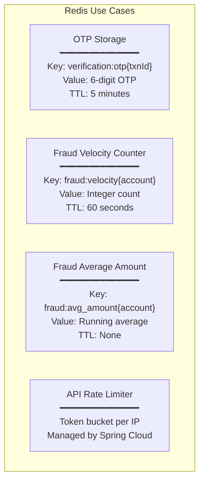
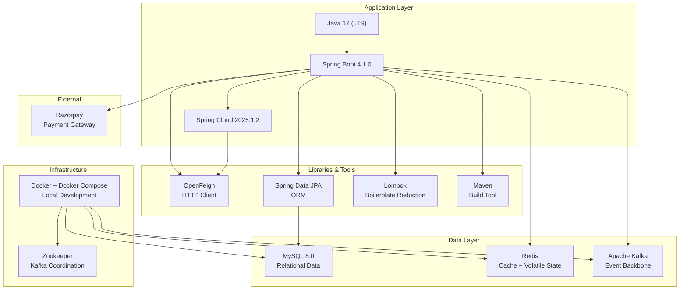

# 02 — Technology Decisions

## 2.1 Decision Framework

Every technology choice must answer three questions:

1. **Why this technology?** — What problem does it solve?
2. **Why not the alternatives?** — What was considered and rejected?
3. **What are the trade-offs?** — What are we gaining and giving up?

---

## 2.2 Programming Language: Java 17

### Decision Matrix

| Criteria | Java 17 ✓ | Go | Node.js | Python |
|---|---|---|---|---|
| **Enterprise ecosystem** | ★★★★★ | ★★★ | ★★★ | ★★★ |
| **Spring Boot support** | ★★★★★ (native) | N/A | N/A | N/A |
| **Type safety** | ★★★★★ (compile-time) | ★★★★ | ★★ (TS helps) | ★★ |
| **Concurrency** | ★★★★ (virtual threads) | ★★★★★ (goroutines) | ★★★ (event loop) | ★★ (GIL) |
| **Financial computing** | ★★★★★ (BigDecimal) | ★★★ | ★★ (float issues) | ★★★ |
| **Talent availability** | ★★★★★ | ★★★ | ★★★★ | ★★★★ |
| **Memory footprint** | ★★ (JVM overhead) | ★★★★★ | ★★★★ | ★★★ |
| **Startup time** | ★★ (JVM warmup) | ★★★★★ | ★★★★ | ★★★ |

**Why Java 17?**
- `BigDecimal` for exact monetary calculations — no floating-point errors
- Spring Boot ecosystem — largest enterprise middleware ecosystem
- Strong typing catches bugs at compile time, not in production
- Java 17 LTS — sealed classes, records, pattern matching, text blocks
- Most banks globally use Java — talent pool and regulatory familiarity

---

## 2.3 Application Framework: Spring Boot 4.1.0

### Why Spring Boot?

| Feature | How It's Used in This System |
|---|---|
| **Auto-configuration** | Zero XML — convention over configuration |
| **Embedded Tomcat** | Each service is a self-contained JAR |
| **Spring Data JPA** | Repository interfaces auto-generate SQL |
| **Spring Cloud Gateway** | Reactive API gateway with rate limiting |
| **Spring Cloud OpenFeign** | Declarative HTTP clients for inter-service calls |
| **Spring Kafka** | `@KafkaListener` annotations for event consumption |
| **Spring Data Redis** | `RedisTemplate` for OTP and counter storage |
| **Actuator** | Health checks, metrics, gateway introspection |

### Why Not Other Frameworks?

| Framework | Rejected Because |
|---|---|
| **Quarkus** | Smaller ecosystem; fewer production deployments in banking |
| **Micronaut** | Less mature Spring Cloud equivalent for gateway, feign, kafka |
| **Vert.x** | Low-level; requires more boilerplate for the same features |
| **Dropwizard** | No integrated gateway, feign, or cloud tooling |

---

## 2.4 Database: MySQL 8.0

### Decision Matrix

| Criteria | MySQL 8.0 ✓ | PostgreSQL | MongoDB | CockroachDB |
|---|---|---|---|---|
| **ACID compliance** | ★★★★★ | ★★★★★ | ★★★ (single doc) | ★★★★★ |
| **Banking industry adoption** | ★★★★★ | ★★★★ | ★★ | ★★ |
| **JPA / Hibernate support** | ★★★★★ | ★★★★★ | ★★ (Spring Data Mongo) | ★★★ |
| **Operational simplicity** | ★★★★ | ★★★★ | ★★★★★ | ★★★ |
| **Read performance** | ★★★★★ | ★★★★ | ★★★★★ | ★★★ |
| **Write performance** | ★★★★ | ★★★★ | ★★★★★ | ★★★★ |
| **Horizontal scaling** | ★★★ (read replicas) | ★★★ | ★★★★★ (native) | ★★★★★ |
| **JSON support** | ★★★ | ★★★★★ | ★★★★★ | ★★★★ |

**Why MySQL?**
- Banking data is inherently relational — accounts, transactions, payments have clear relationships
- ACID guarantees are non-negotiable for financial operations
- InnoDB storage engine provides row-level locking, MVCC, crash recovery
- MySQL 8.0 adds window functions, CTEs, JSON improvements
- Most deployed database in the world — proven reliability

**Why Not MongoDB?**
- Transactions across collections lack the robustness of SQL transactions
- Schema flexibility is a liability in banking — you WANT strict schemas
- Monetary aggregations are better served by SQL's `SUM`, `GROUP BY`

---

## 2.5 Message Broker: Apache Kafka

### Decision Matrix

| Criteria | Kafka ✓ | RabbitMQ | Amazon SQS | Redis Streams |
|---|---|---|---|---|
| **Throughput** | ★★★★★ (millions/s) | ★★★ (tens of thousands/s) | ★★★★ | ★★★★ |
| **Message retention** | ★★★★★ (configurable days) | ★ (consumed = deleted) | ★★ (14 days max) | ★★★ |
| **Event replay** | ★★★★★ | ✗ | ✗ | ★★★ |
| **Consumer groups** | ★★★★★ | ★★★ (exchanges) | ★★ | ★★★ |
| **Ordering** | ★★★★★ (per partition) | ★★ | ★ (FIFO queues) | ★★★★ |
| **Ecosystem** | ★★★★★ (Connect, Streams, ksqlDB) | ★★★ | ★★★ | ★★ |
| **Operational complexity** | ★★ (Zookeeper, brokers) | ★★★★ | ★★★★★ (managed) | ★★★★★ |

**Why Kafka?**
- **Event replay**: If Notification Service crashes, it can reprocess missed events from Kafka offsets
- **Multiple consumers**: `transaction.completed` is consumed by BOTH Account Service and Notification Service independently
- **Ordering guarantees**: Same `transactionId` key → same partition → ordered processing
- **Audit log**: Kafka topics serve as an immutable audit trail of all financial events
- **Throughput**: Designed for high-volume event streaming — perfect for a banking system at scale

**Why Not RabbitMQ?**
- Messages are deleted after consumption — no replay, no audit trail
- No native partitioning — harder to guarantee ordering
- Lower throughput ceiling for high-volume event streaming

---

## 2.6 Cache & Volatile Storage: Redis

### Use Cases in This System

**Why Redis?**
- **Sub-millisecond latency**: OTP lookups and fraud checks must be fast
- **Atomic operations**: `INCR` for velocity counting is atomic — no race conditions
- **Native TTL**: OTP auto-expires after 5 minutes — no cleanup jobs needed
- **Spring integration**: `RedisTemplate` and `ReactiveRedisTemplate` are first-class Spring citizens

**Why Not Memcached?**
- No TTL per key (only at slab level)
- No atomic increment
- No persistence options
- No data structures (only key-value strings)

---

## 2.7 Inter-Service Communication: Spring Cloud OpenFeign

### Why Feign Over Alternatives?

| Criteria | Feign ✓ | RestTemplate | WebClient | gRPC |
|---|---|---|---|---|
| **Boilerplate** | ★★★★★ (zero) | ★★ (verbose) | ★★★ (reactive) | ★★★ (proto files) |
| **Declarative** | ★★★★★ (interface only) | ✗ (imperative) | ✗ (imperative) | Partially |
| **Spring integration** | ★★★★★ (native) | ★★★★ (deprecated) | ★★★★★ | ★★★ |
| **Load balancing** | ★★★★★ (built-in) | ★★★ (manual) | ★★★ (manual) | ★★★ |
| **Readability** | ★★★★★ | ★★ | ★★★ | ★★★ |
| **Performance** | ★★★ (HTTP/1.1) | ★★★ | ★★★★ (non-blocking) | ★★★★★ (HTTP/2, binary) |

**Why Not gRPC?**
- Adds complexity (protobuf schema management, code generation)
- REST is simpler for the current scale
- gRPC would be warranted at >10,000 RPS between services

---

## 2.8 API Gateway: Spring Cloud Gateway

### Why Not Other Gateways?

| Gateway | Pros | Cons | Decision |
|---|---|---|---|
| **Spring Cloud Gateway ✓** | Native Spring integration, reactive, Java-based | Heavier than Nginx | Selected — same tech stack, easy to customize |
| **Nginx** | Extremely fast, battle-tested | No Java integration, separate deployment | Rejected — different operational model |
| **Kong** | Plugin ecosystem, API management | Lua-based, complex setup | Rejected — over-engineered for current needs |
| **AWS API Gateway** | Fully managed, auto-scaling | Vendor lock-in, cold starts | Rejected — vendor-agnostic goal |
| **Envoy** | Service mesh grade, gRPC native | Complex configuration | Rejected — too low-level |

---

## 2.9 Payment Gateway: Razorpay

### Why Razorpay?

| Criteria | Razorpay ✓ | Stripe | PayPal |
|---|---|---|---|
| **India market** | ★★★★★ (UPI, Netbanking, Wallets) | ★★★ (limited UPI) | ★★ |
| **Java SDK** | ★★★★ | ★★★★★ | ★★★ |
| **Webhook reliability** | ★★★★ | ★★★★★ | ★★★ |
| **Documentation** | ★★★★ | ★★★★★ | ★★★ |
| **Global reach** | ★★★ | ★★★★★ | ★★★★★ |

**Design Decision:** The `PaymentService` is designed to be **gateway-agnostic**. Swapping Razorpay for Stripe would require changes only in `PaymentService.java` — no other service is affected.

---

## 2.10 Build Tool: Maven

### Why Maven Over Gradle?

| Criteria | Maven ✓ | Gradle |
|---|---|---|
| **Convention over configuration** | ★★★★★ | ★★★ (flexible = complex) |
| **XML familiarity** | ★★★★★ (enterprise standard) | ★★★ (Groovy/Kotlin DSL) |
| **Dependency management** | ★★★★★ | ★★★★★ |
| **Build speed** | ★★★ | ★★★★★ (incremental builds) |
| **Spring Boot integration** | ★★★★★ | ★★★★★ |
| **Learning curve** | ★★★★ (simple for standard projects) | ★★★ (custom tasks need DSL knowledge) |

**Decision:** Maven — simpler for standard Spring Boot projects. Each microservice has an independent `pom.xml` (no parent POM aggregation), which is appropriate for independently deployed services.

---

## 2.11 Technology Stack Summary

