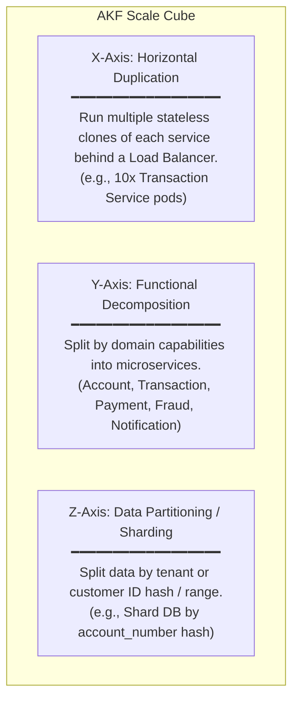
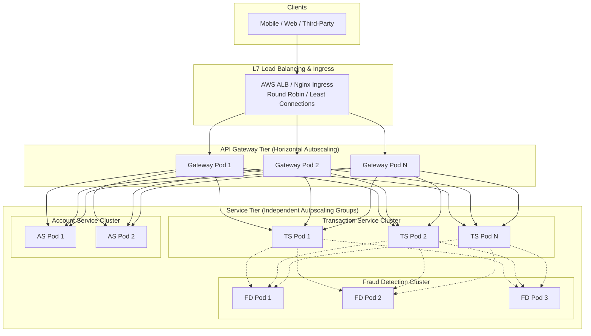
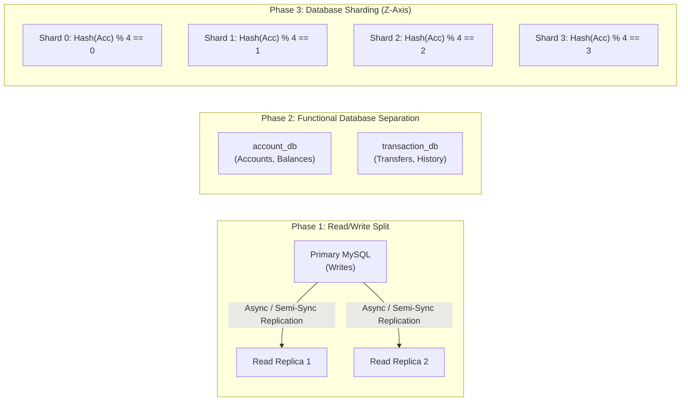
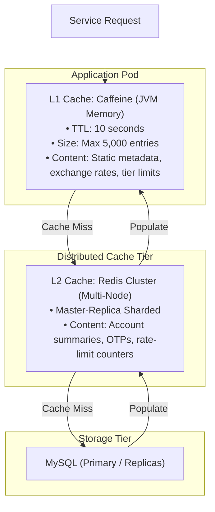
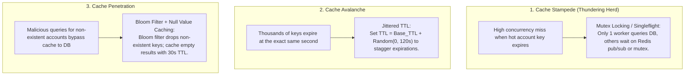
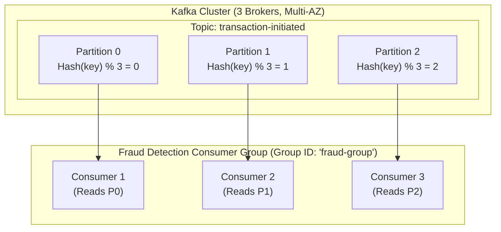
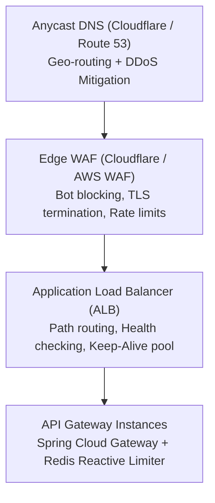

# 03 — Scalability Design

## 3.1 Scaling Philosophy & The AKF Scale Cube

Scalability is the ability of a system to handle increased load without sacrificing throughput, latency, or data integrity. For a financial microservices platform, scaling must preserve ACID guarantees on money movement while serving millions of reads and thousands of write transactions per second.

| Axis | Dimension | Application in this Banking System |
|---|---|---|
| **X-Axis** | Horizontal Duplication | All services (`account-service`, `transaction-service`, etc.) are stateless and scale horizontally via Kubernetes Horizontal Pod Autoscaler (HPA). |
| **Y-Axis** | Service Decomposition | 5 core domains split into independent services. Transaction spikes do not choke Account management. |
| **Z-Axis** | Sharding / Partitioning | Database partitioned by `account_number` hash modulo $N$. Kafka topics partitioned by `accountNumber` key. |

---

## 3.2 Service Tier Scaling (Stateless Compute)

### Stateless Design Principles
Every microservice in this banking architecture is strictly **stateless**:
1. **No Session Sticky Routing**: Requests can hit any instance of any service without state loss.
2. **Externalized Ephemeral State**: Session tokens, temporary OTPs, rate limit buckets, and idempotency locks live in Redis, never in JVM memory.
3. **Graceful Termination**: On scale-down or rolling deployment, SIGTERM allows inflight transactions 30s to finish before pod eviction.

### Autoscaling Metrics & Thresholds

| Service | Scaling Metric | Scale-Out Trigger | Scale-In Trigger | Min/Max Pods |
|---|---|---|---|---|
| **API Gateway** | Request Latency & CPU | CPU > 70% OR Latency p95 > 150ms | CPU < 35% for 10m | 3 / 20 |
| **Transaction Service** | Request Queue & CPU | CPU > 65% OR Active Connections > 400 | CPU < 30% for 15m | 4 / 30 |
| **Account Service** | Read QPS & CPU | CPU > 70% | CPU < 40% for 10m | 2 / 15 |
| **Fraud Detection** | Kafka Consumer Lag | Lag > 5,000 messages OR CPU > 75% | Lag < 500 for 10m | 3 / 25 |
| **Notification Service** | Kafka Consumer Lag | Lag > 10,000 messages | Lag < 1,000 for 10m | 2 / 10 |

---

## 3.3 Database Scaling Strategy

Databases are the stateful bottleneck of any financial system. We scale the data tier through a 3-stage progressive evolution:

### 1. Read-Write Splitting (Current & Immediate)
- **Primary Node**: Handles all balance debits, credits, and transaction insertions.
- **Read Replicas (2-3 Nodes)**: Handles account balance inquiries, statement downloads, and historical queries.
- **Lag Mitigation**: For read-your-own-writes (e.g. user checks balance immediately after a transfer), routing directs the query to Primary for 3 seconds post-mutation using a replica-lag bypass cookie/header.

### 2. Connection Pooling Architecture
Unchecked connection spikes from auto-scaling microservices will exhaust database file descriptors and memory.
- **HikariCP (Application Level)**:
  - `maximumPoolSize`: 20 per pod
  - `minimumIdle`: 5
  - `idleTimeout`: 300,000ms (5m)
  - `connectionTimeout`: 5,000ms
- **ProxySQL / RDS Proxy (Middleware Tier)**:
  - Multiplexes thousands of microservice frontend connections into a static, high-efficiency connection pool (e.g., 100 physical connections to MySQL).
  - Handles automated query routing (writes $\to$ Primary, reads $\to$ Replicas).

### 3. Horizontal Sharding Strategy (Target Scale > 10M Accounts)
When a single MySQL instance exceeds 1TB or 5,000 write IOPS:
- **Shard Key**: `MurmurHash3(account_number)`
- **Cross-Shard Transfers**: Orchestrated using the existing SAGA pattern! Because `transaction-service` already treats debits and credits as decoupled asynchronous steps with compensating actions, cross-shard transactions require zero distributed two-phase commit (2PC) locks.

---

## 3.4 Caching Architecture

Caching reduces read latency from 15ms (SQL) to < 1ms (Redis). In banking, stale data can cause overdrafts or user panic, so cache invalidation and consistency are strictly controlled.

### Cache Invalidation Patterns

| Cache Target | Pattern | Invalidation Rule | TTL |
|---|---|---|---|
| **Account Details** | Cache-Aside + Write-Through Invalidation | Evicted on any balance change or account status update (`account:ACC123`) | 15 minutes |
| **OTP State** | Direct Key-Value Store | Ephemeral key created on transfer trigger; consumed and deleted on verification | 5 minutes strictly |
| **Fraud Velocity Counters** | Redis Atomic Increments | `INCRBY` on sliding-window keys (`fraud:velocity:ACC123:1m`) | Window length (60s) |
| **API Rate Limits** | Redis Sliding Window / Token Bucket | Decremented per request | 60 seconds |

### Mitigating Classic Cache Failures

---

## 3.5 Messaging & Kafka Scaling

Kafka is the nervous system of this platform. It absorbs sudden traffic spikes, preventing downstream systems from crashing.

### Partition Key Strategy
- **Crucial Rule**: Events must guarantee **in-order processing per account** while allowing massive global parallelism.
- **Partition Key**: `accountNumber` (or `senderAccountNumber`).
  - All transactions for Account A map to Partition 0.
  - All transactions for Account B map to Partition 1.
  - Kafka guarantees FIFO delivery within a partition, preventing race conditions like debit arriving after credit for a single account.
- **Partition Count Formula**:
  $$\text{Partitions} = \max\left(\frac{\text{Target Throughput}}{\text{Single Producer Throughput}}, \frac{\text{Target Throughput}}{\text{Single Consumer Throughput}}\right)$$
  - Designed for 12 partitions per high-throughput topic (`transaction-events`), allowing up to 12 parallel consumer instances per service.

---

## 3.6 Edge & Load Balancing Architecture

### Rate Limiting Strategy
- **Global Perimeter Limit**: 10,000 requests/sec across all IP ranges at WAF.
- **User / IP Specific Limit**: Implemented in Spring Cloud Gateway using Redis Token Bucket:
  - Standard Account Inquiries: 100 requests / minute / user.
  - Transfer Execution: 10 requests / minute / account.
  - OTP Verification: 5 attempts / minute / transfer (prevents brute-force attacks).
