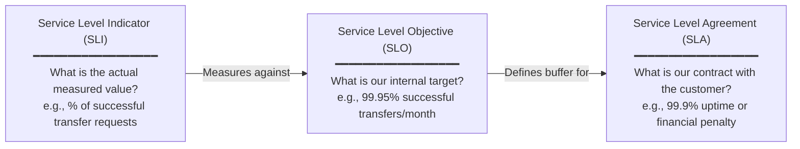
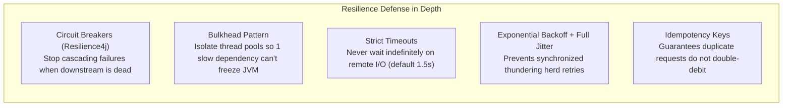
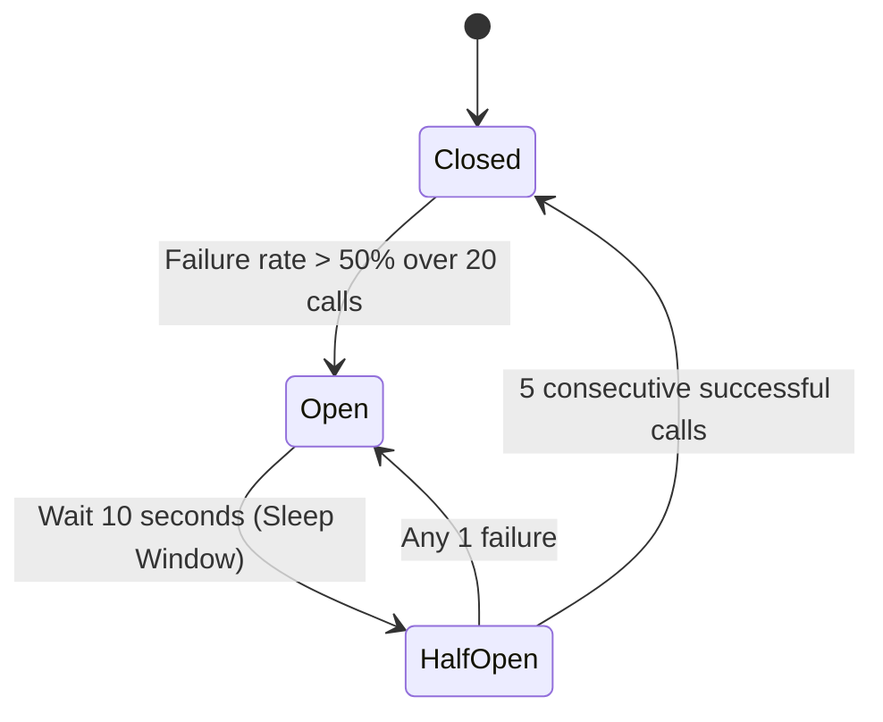
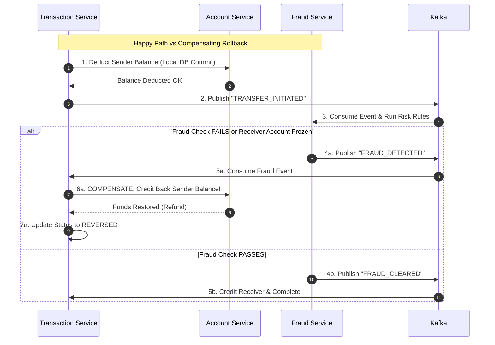
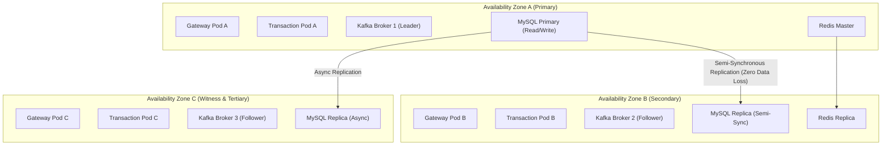
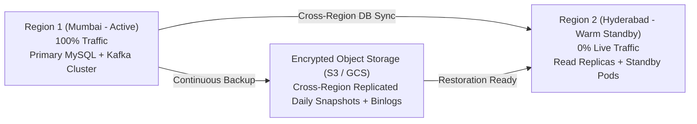

# 04 — Availability & Reliability Design

## 4.1 Reliability Targets: SLA, SLO, and SLI

In financial systems, availability and reliability are existential requirements. Every minute of outage erodes consumer trust and risks regulatory penalties.



### Banking System SLA Metrics

| Metric | Target | Monthly Error Budget | Definition |
|---|---|---|---|
| **Core Availability** | **99.95%** | 21.9 minutes downtime | API Gateway and Core Account lookups returning HTTP 2xx/3xx. |
| **Transfer Success Rate** | **99.99%** | 1 failed transfer per 10,000 | Non-user errors (excluding insufficient balance or invalid PIN). |
| **Transfer Latency (p95)** | **< 800ms** | - | Time from HTTP POST initiation to synchronous response receipt. |
| **End-to-End Settlement** | **< 3000ms** | - | Time until funds are completely settled or compensated. |
| **Mean Time to Detect (MTTD)** | **< 2 minutes** | - | Time from anomaly start to automated PagerDuty trigger. |
| **Mean Time to Recover (MTTR)** | **< 15 minutes** | - | Automated failover, rolling restart, or rollback completion. |

---

## 4.2 Failure Mode and Effects Analysis (FMEA)

A resilient system assumes **everything will fail eventually**. Below is the blast radius matrix:

| Component Failed | Immediate Symptom | Blast Radius | Graceful Degradation / Fallback Strategy |
|---|---|---|---|
| **API Gateway** | Complete API unavailability | Critical (100% of ingress traffic) | Multi-AZ redundant Gateway instances behind AWS ALB. Health check evicts failed instances in 5s. |
| **Account Service** | Cannot fetch balance or create accounts | High (Transfers & queries blocked) | Read-only cached balances served from Redis with "As of [time]" badge. New transfers temporarily paused with HTTP 503 + `Retry-After`. |
| **Transaction Service** | Cannot initiate new transfers | High | Existing transfers in Kafka continue processing to completion. API returns explicit "Queue Full / Try Later". |
| **Fraud Detection Service** | Real-time fraud scoring delayed | Medium | **Fail-Open Policy for small amounts** (< $50) with asynchronous post-transaction audit. **Fail-Secure for large amounts** (> $50) triggering mandatory OTP challenge. |
| **Notification Service** | SMS/Email delayed | Low | Zero impact on money flow. Events queue safely in Kafka `notification-topic` (persisted up to 7 days). |
| **Kafka Cluster** | Event publishing fails | Critical | Local Transactional Outbox table in MySQL buffers events until Kafka recovers. Services do NOT crash. |
| **Redis Cache** | OTP and rate limiting disrupted | Medium | Graceful fallback to SQL DB queries; rate limiting defaults to local in-memory token bucket on Gateway. |
| **Razorpay Gateway** | External card/UPI payments fail | Medium | Payment service marks order as `PENDING_RETRY`; webhook retries up to 24h. Transfers between internal accounts unaffected. |

---

## 4.3 Resilience Patterns & Fault Isolation



### 1. Circuit Breakers (Resilience4j State Machine)



**Configuration Standard Across Microservices:**
```yaml
resilience4j.circuitbreaker:
  instances:
    accountService:
      slidingWindowType: COUNT_BASED
      slidingWindowSize: 20
      minimumNumberOfCalls: 10
      failureRateThreshold: 50.0
      slowCallRateThreshold: 75.0
      slowCallDurationThreshold: 2000ms
      waitDurationInOpenState: 10000ms
      permittedNumberOfCallsInHalfOpenState: 5
      automaticTransitionFromOpenToHalfOpenEnabled: true
```

### 2. Bulkhead Isolation
Each outbound integration (e.g. Feign client to Account Service, Razorpay HTTP client) is allocated a dedicated thread pool and semaphore.
- **Account Service Calls**: 25 concurrent threads max.
- **Razorpay API Calls**: 10 concurrent threads max.
- *Result*: If Razorpay hangs for 30 seconds, internal banking transfers continue at 100% capacity because their thread pools remain untouched.

### 3. Retry with Exponential Backoff and Full Jitter
Linear or constant retries cause "retry storms" that crash recovering databases.
$$\text{Sleep Time} = \text{Random}(0, \; \min(\text{MaxSleep}, \; \text{BaseSleep} \times 2^{\text{attempt}}))$$

```
Attempt 1: Sleep between 0 and 200ms
Attempt 2: Sleep between 0 and 400ms
Attempt 3: Sleep between 0 and 800ms
After 3 attempts: Send to Dead Letter Queue (DLQ)
```

---

## 4.4 SAGA Failure Recovery & Compensation

Because distributed transactions span multiple databases, traditional two-phase locking (2PC) is rejected due to latency and lock contention. We use the **Sorensen-style SAGA Choreography pattern**.



### Reconciliation Engine ("The Safety Net")
What if a network partition drops messages halfway through a SAGA?
- A scheduled cron worker (`TransactionReconciliationJob`) runs every 5 minutes:
  1. Queries all transactions stuck in `PENDING` or `PROCESSING` state for $> 5$ minutes.
  2. Issues status probe to Account Service and Payment Gateway.
  3. Automatically triggers forward completion OR executes compensating reversal.
  4. Alerts on-call engineering if discrepancy persists beyond 15 minutes.

---

## 4.5 High Availability (HA) & Redundancy Architecture



### Database High Availability (Orchestrator / Patroni / RDS Multi-AZ)
- **Semi-Synchronous Replication**: Transaction commits are not acknowledged to the client until written to the binary log of at least one replica in AZ-B.
- **Automated Failover**: If Master fails:
  1. Health check detects loss of heartbeats in 10s.
  2. AZ-B Replica with latest GTID is promoted to Master.
  3. Virtual IP (VIP) / DNS switch completes in $< 30$ seconds.

### Kafka High Availability Configuration
- `replication.factor = 3` (1 copy in each AZ).
- `min.insync.replicas = 2` (Guarantees writes persist in at least 2 AZs before producer ACK).
- `acks = all` on all financial event producers.

---

## 4.6 Disaster Recovery (DR) Strategy

| Metric | Target | Method |
|---|---|---|
| **Recovery Point Objective (RPO)** | **$\le$ 0 seconds** within Region<br/>**$< 1$ minute** across Regions | Semi-sync replication across AZs; continuous binary log streaming to cross-region S3 bucket. |
| **Recovery Time Objective (RTO)** | **$< 30$ seconds** for AZ failure<br/>**$< 30$ minutes** for full Regional catastrophe | Automated failover for AZs; Warm Standby (Pilot Light) infrastructure in secondary region (e.g., US-East to US-West). |


