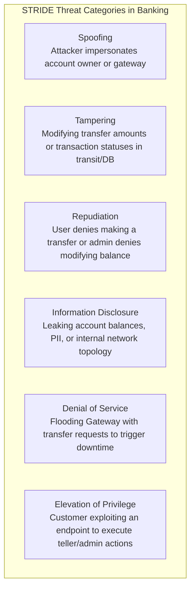
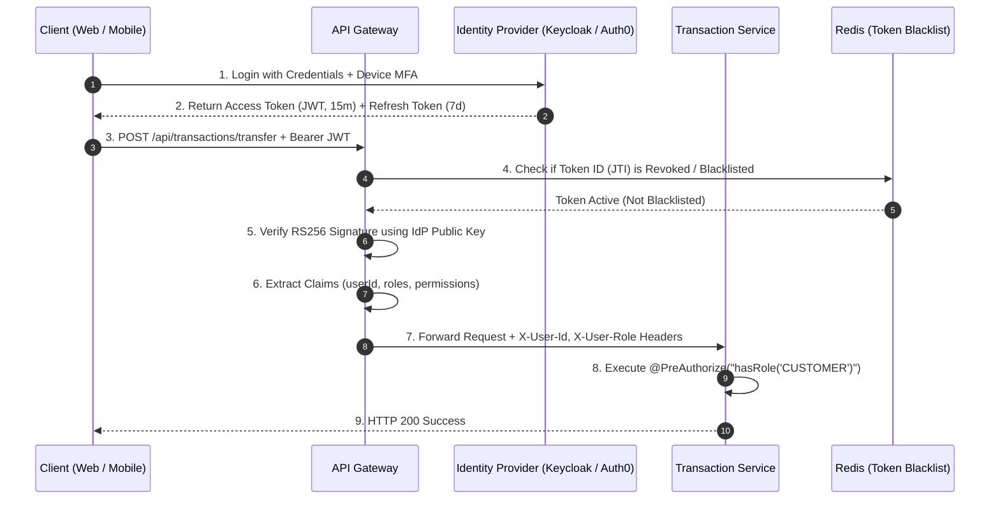
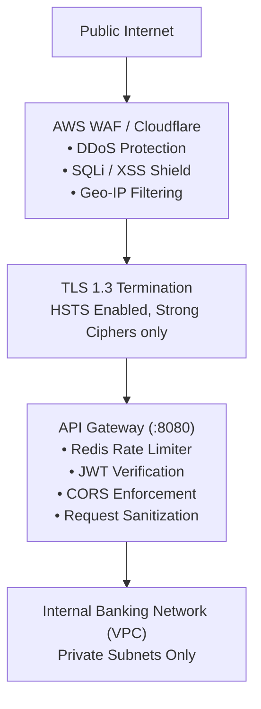
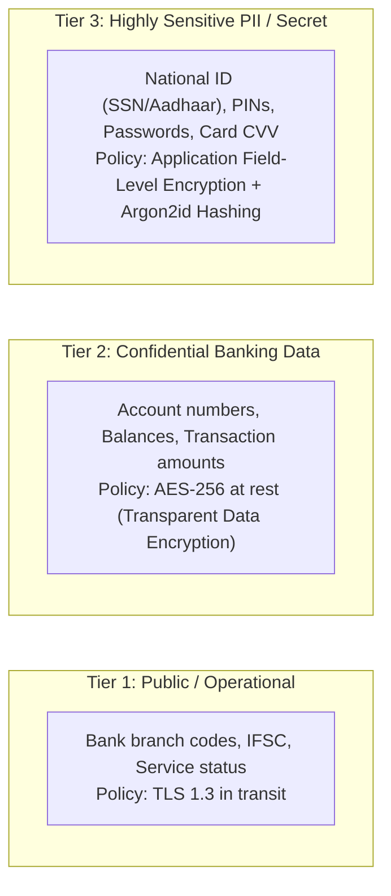
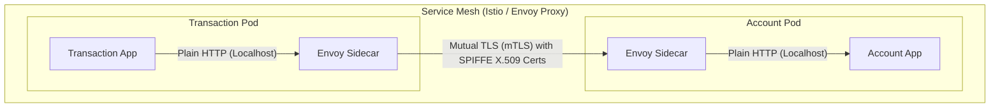
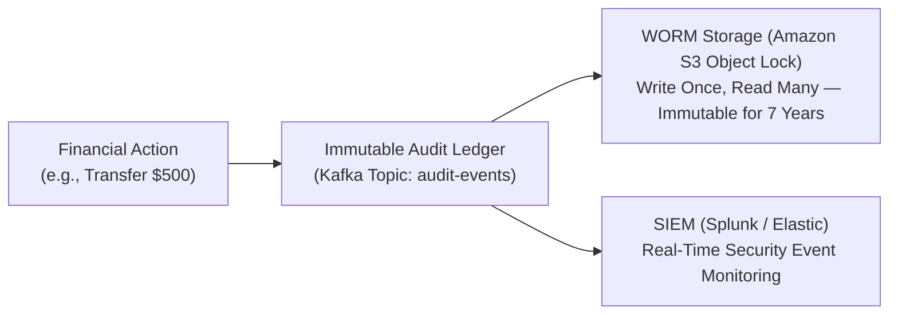

# 05 — Security Design

## 5.1 Threat Modeling: STRIDE Analysis

A banking system is a high-value target for sophisticated cybercriminals, internal rogue actors, and automated bot networks. We systematically evaluate the system using the **STRIDE** methodology:



| Threat | Vulnerability Vector | Defense Implemented in Architecture |
|---|---|---|
| **Spoofing** | Stolen credentials, forged session tokens | OIDC/OAuth 2.0 with RS256 signed JWTs; Multi-Factor Auth (SMS/Email OTP for transfers > $100). |
| **Tampering** | Man-in-the-Middle (MitM) or DB row alteration | End-to-End TLS 1.3; HMAC payload signatures on webhooks; DB row-level cryptographic hash checks. |
| **Repudiation** | Customer claims: "I never sent this money" | Immutable Kafka audit topic + write-once audit log table containing IP, User-Agent, timestamp, and device fingerprint. |
| **Information Disclosure** | SQL injection, leaked stack traces, open logs | Parameterized queries via Spring Data JPA; PII field-level AES-256 encryption; centralized log scrubbing (masks card/account numbers). |
| **Denial of Service** | Botnet hammering transfer endpoints | Cloudflare Edge DDoS mitigation; Spring Cloud Gateway Redis Token Bucket rate limiting; strict connection limits. |
| **Elevation of Privilege** | Normal user calling `/api/accounts/block` | Role-Based Access Control (RBAC) enforced at Gateway and verified inside each microservice via `@PreAuthorize`. |

---

## 5.2 Authentication & Authorization Architecture

The system implements a modern **Zero-Trust Identity Architecture** using OpenID Connect (OIDC) and OAuth 2.0 with stateless JSON Web Tokens (JWT).



### JWT Token Structure & Security
- **Algorithm**: Asymmetric `RS256` (RSA Signature with SHA-256). Private key stays strictly in Auth Server; public keys distributed via JWKS endpoint (`/.well-known/jwks.json`).
- **Lifespan**:
  - Access Token: Short-lived (**15 minutes**) to limit stolen token blast radius.
  - Refresh Token: Long-lived (**7 days**), stored in secure `HttpOnly`, `SameSite=Strict` cookies.
- **Instant Revocation (Blacklist)**:
  - If an account is frozen or user logs out, the JWT unique identifier (`jti`) is written to Redis with a TTL equal to the token's remaining lifespan. The Gateway checks this cache before routing.

---

## 5.3 Edge & API Gateway Security



### Gateway Security Controls
1. **Strict Transport Security (HSTS)**:
   ```http
   Strict-Transport-Security: max-age=63072000; includeSubDomains; preload
   ```
2. **Cross-Origin Resource Sharing (CORS)**:
   - Whitelist restricted solely to trusted bank domains (e.g., `https://banking.example.com`).
   - Wildcards (`*`) strictly rejected.
3. **Webhook Security (Payment Gateway)**:
   - Razorpay webhook callbacks are authenticated by calculating an HMAC-SHA256 signature using a shared secret key and matching it against the `X-Razorpay-Signature` header.

---

## 5.4 Data Protection & Cryptography

Banking data is classified into 3 sensitivity tiers with corresponding encryption policies:



### Cryptographic Standards

| Layer | Technique | Standard | Key Management |
|---|---|---|---|
| **In-Transit** | Network Transport Layer Security | TLS 1.3 exclusively (disable TLS 1.0, 1.1, 1.2) | AWS Certificate Manager / Let's Encrypt auto-renewed |
| **At-Rest (DB & Kafka)** | Transparent Storage Encryption | AES-256-GCM | AWS KMS / HashiCorp Vault with annual key rotation |
| **Field-Level (Application)** | Sensitive PII Column Encryption | AES-256-CBC with per-column Initialization Vector (IV) | HashiCorp Vault Transit Engine |
| **Passwords & PINs** | One-Way Salted Password Hash | Argon2id (Memory: 64MB, Iterations: 3, Parallelism: 4) | Salts generated with CSPRNG |

---

## 5.5 Zero-Trust Service-to-Service Security (East-West Traffic)

In traditional systems, the internal network is treated as a "trusted zone". If an attacker breaches the perimeter, they can move laterally unimpeded. This architecture adopts **Zero-Trust**:



### 1. Mutual TLS (mTLS)
- Every inter-service HTTP/gRPC call is wrapped in mutual TLS.
- Envoy sidecars negotiate cryptographic identity. Even if an attacker taps internal VPC network packets, all inter-service traffic is indecipherable.

### 2. Kubernetes Network Policies
- Strict network rules isolate services.
- `payment-service` has zero network route to `account-service`.
- Only `transaction-service` has firewall permissions to send traffic to `account-service:8081`.

---

## 5.6 Compliance & Regulatory Auditability

To comply with financial regulatory frameworks (**PCI-DSS 4.0**, **SOC 2 Type II**, **RBI Cyber Security Framework**):



1. **Non-Repudiation Audit Log**:
   - Every financial state transition publishes an immutable event with:
     - `eventId`, `timestamp`, `initiatorUserId`, `sourceIp`, `action`, `beforeState`, `afterState`, and `cryptographicSignature`.
2. **Log Redaction & Sanitization**:
   - Automated Logback filters scan standard stdout/stderr for regex patterns matching Credit Card PANs, bank account numbers, and OTPs, replacing them with `****-****-****-1234` before reaching logging collectors.
