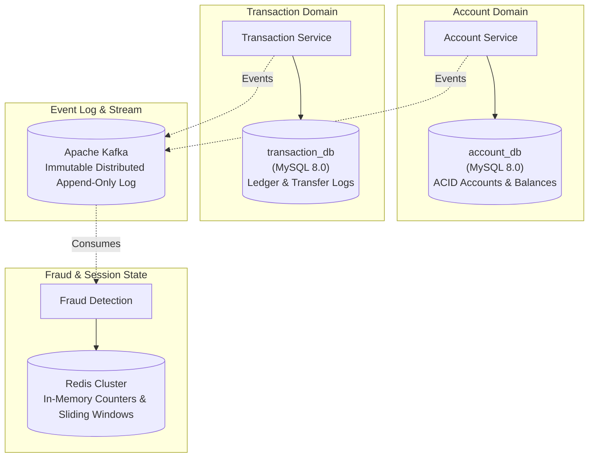
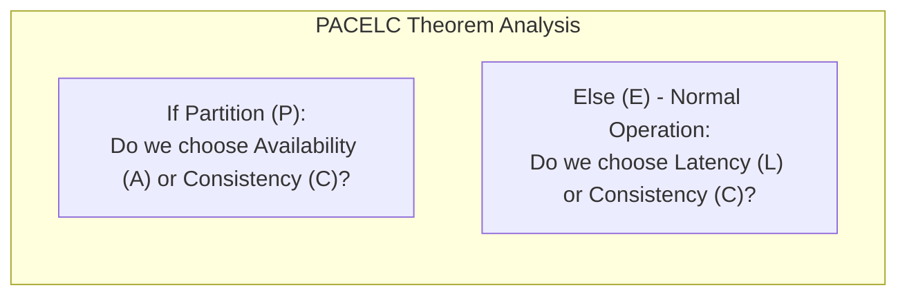
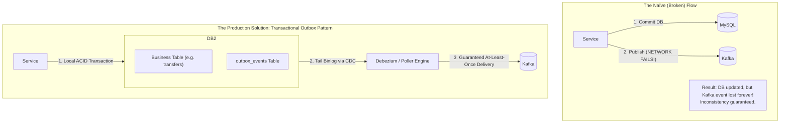
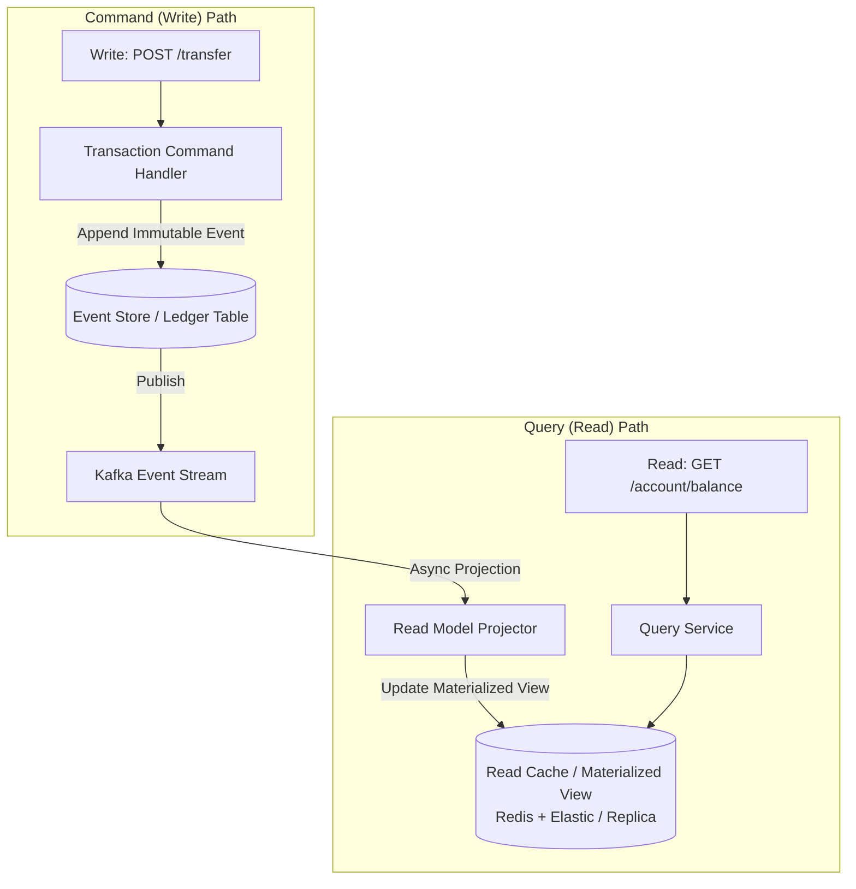
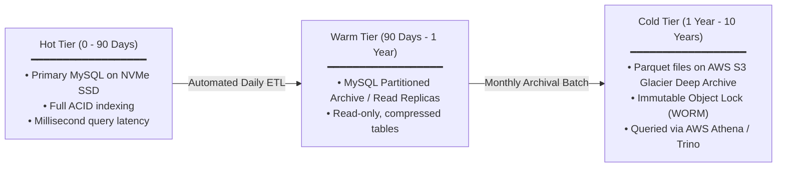
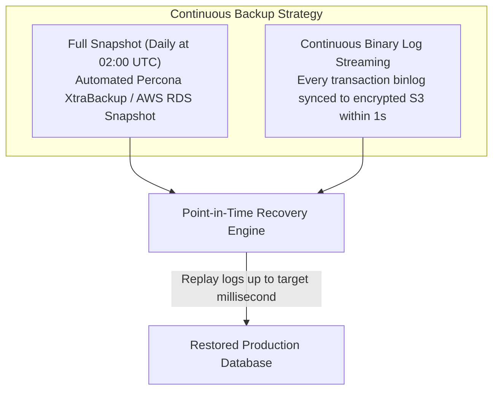

# 06 — Data Architecture

## 6.1 Database-per-Service & Polyglot Persistence

The golden rule of microservices is strictly enforced: **No service may directly access another service's database.** All cross-domain data access must pass through well-defined APIs or asynchronous event streams.



### Polyglot Storage Selection Rationale

| Store | Type | Service | Why this technology? |
|---|---|---|---|
| **account_db** | Relational (MySQL 8.0) | Account Service | Strict ACID guarantees required for balance mutations; pessimistic locking (`SELECT FOR UPDATE`) prevents double-spending. |
| **transaction_db** | Relational (MySQL 8.0) | Transaction Service | Strong schema enforcement; relational joins between transfers, audits, and SAGA state. |
| **Redis** | In-Memory Key-Value | Fraud / Gateway / Auth | Sub-millisecond latency for rate limit counters, temporary OTP keys, and velocity tracking. |
| **Kafka** | Distributed Commit Log | Cross-Cutting | High-throughput durable event streaming, re-playable event logs, and consumer decoupling. |

---

## 6.2 Consistency Models: CAP & PACELC Trade-Offs

Distributed financial platforms cannot choose "Strong Consistency Everywhere" without catastrophic latency and downtime during network partitions.



### The System Trade-Off: **PC/EC within Service, PA/EL across Services**
1. **Intra-Service (Single Account Balance)**:
   - **Model**: **Strict ACID Consistency (PC/EC)**.
   - When deducting balance from Account A, MySQL transactions use `REPEATABLE READ` isolation. If database replicas disagree or network partitions occur, the write fails rather than risk an incorrect balance.
2. **Inter-Service (Account A $\to$ Account B Transfer)**:
   - **Model**: **Eventual Consistency with SAGA Guarantees (PA/EL)**.
   - The deduction from Sender and deposit to Receiver occur across independent microservices via Kafka events. At millisecond $t_1$, Sender is debited; at $t_2$, Receiver is credited. During the transient interval ($t_1 \to t_2$), money is "in-flight". SAGA compensation ensures money is never permanently lost.

---

## 6.3 The Dual-Write Problem & Transactional Outbox Pattern

A critical bug in naïve microservice implementations is the **Dual-Write Problem**: writing to the database and publishing to Kafka in the same HTTP request.



### Outbox Schema Design
```sql
CREATE TABLE outbox_events (
    event_id VARCHAR(36) PRIMARY KEY,
    aggregate_type VARCHAR(50) NOT NULL,    -- 'ACCOUNT', 'TRANSACTION'
    aggregate_id VARCHAR(50) NOT NULL,      -- 'ACC10001', 'TXN-9023'
    event_type VARCHAR(100) NOT NULL,       -- 'TRANSFER_INITIATED'
    payload JSON NOT NULL,                  -- Serialized event data
    created_at TIMESTAMP DEFAULT CURRENT_TIMESTAMP,
    processed BOOLEAN DEFAULT FALSE,
    INDEX idx_outbox_unprocessed (processed, created_at)
);
```
- **Atomicity**: The business mutation and the event insertion occur in the **exact same database transaction**. Either both persist, or neither does.
- **Delivery**: A Change Data Capture (CDC) worker (Debezium) reads the MySQL binary log and streams events to Kafka with guaranteed at-least-once delivery.

---

## 6.4 Event Sourcing & CQRS (Command Query Responsibility Segregation)

To provide an unalterable audit trail and high-performance balance inquiries, the transaction architecture implements CQRS.



### Why CQRS for Banking?
1. **Write Path Optimization**: The write path only does rapid, sequential appends to the ledger. There are no expensive table joins or aggregations during money transfer execution.
2. **Read Path Optimization**: Read queries (account balance, mini-statements, transaction search) read from denormalized, pre-aggregated views in Redis or MySQL read-replicas.
3. **Audit Trail**: Every balance is mathematically derivable as:
   $$\text{Current Balance} = \sum \text{Credits} - \sum \text{Debits}$$

---

## 6.5 Data Lifecycle: Tiered Storage & Archival

Financial regulations (e.g. FINRA, RBI) require transaction records to be retained for **7 to 10 years**. Storing years of cold data on high-performance NVMe SSDs causes database degradation and sky-high costs.



### Database Partitioning Scheme
The `transactions` table is partitioned by range on `transaction_date`:
```sql
ALTER TABLE transactions PARTITION BY RANGE (YEAR(created_at) * 100 + MONTH(created_at)) (
    PARTITION p202601 VALUES LESS THAN (202602),
    PARTITION p202602 VALUES LESS THAN (202603),
    PARTITION p202603 VALUES LESS THAN (202604),
    PARTITION p_future VALUES LESS THAN MAXVALUE
);
```
- Querying a single month uses **Partition Pruning**, scanning only that month's partition instead of 50 million rows.
- Dropping or archiving an old month is an instantaneous $O(1)$ metadata operation: `ALTER TABLE transactions DROP PARTITION p201901;`.

---

## 6.6 Backup & Point-In-Time Recovery (PITR)

Data loss in a bank is unacceptable. The backup strategy ensures a **Recovery Point Objective (RPO) $\le$ 1 second**.



### Disaster Recovery Drill Policy
- **Automated Validation**: A weekly automated CI job restores the latest backup into an isolated staging environment and runs checksum integrity verification scripts against all account balances.
- **Failover Testing**: Chaos engineering tests simulate unannounced master database kills quarterly to verify automated replica promotion without human intervention.
