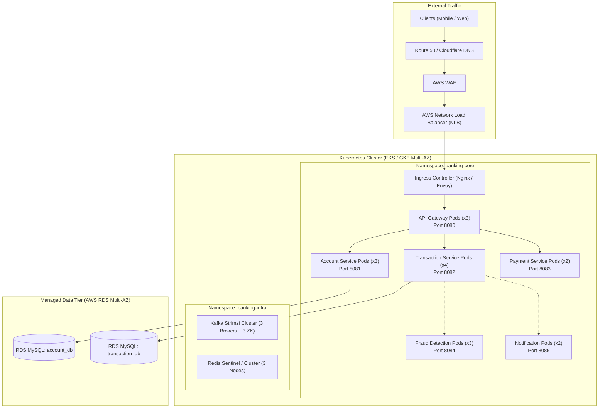
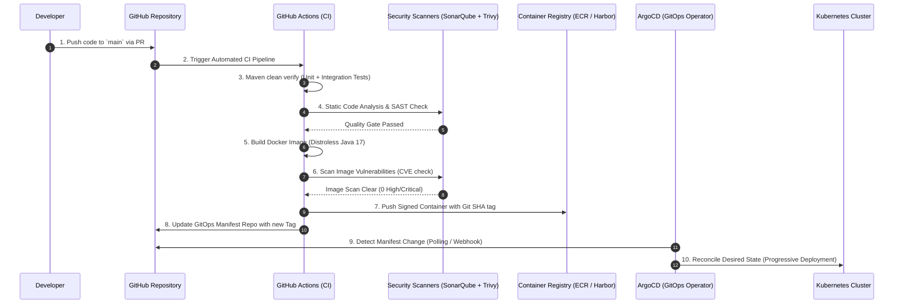
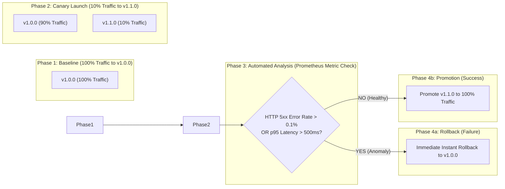
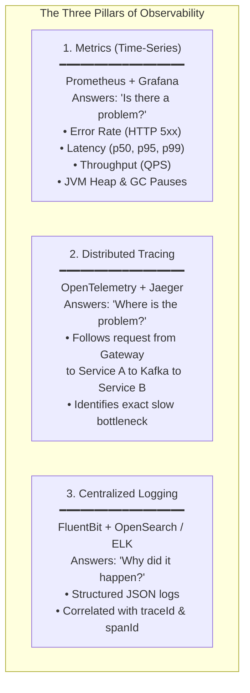
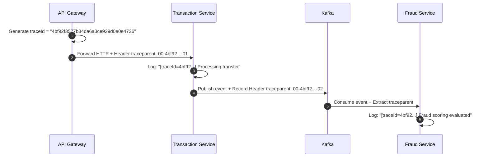
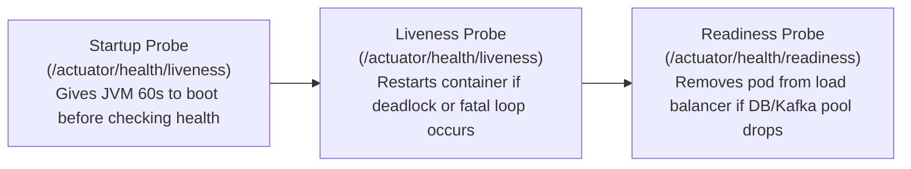

# 07 — Deployment & DevOps

## 7.1 Production Infrastructure Architecture

The banking platform is deployed on managed Kubernetes (AWS EKS / Google GKE) spanning **3 Availability Zones (AZs)** for high availability, zero-downtime rolling upgrades, and infrastructure-as-code automation.



### Namespace Isolation & Network Policies
- `banking-core`: Business microservice pods.
- `banking-infra`: Shared internal middleware (Kafka, Redis).
- `banking-monitoring`: Observability stack (Prometheus, Grafana, OpenTelemetry).
- **NetworkPolicy**: Denies all cross-namespace traffic by default; strictly whitelists port communication (e.g. only `TS_PODS` can open connections to `AS_PODS:8081`).

---

## 7.2 CI/CD Pipeline & GitOps Workflow

Code transitions from developer commit to production through a fully automated, immutable container pipeline governed by **GitOps** principles.



---

## 7.3 Progressive Deployment Strategies

Financial systems cannot tolerate full-cluster restarts or downtime during releases. We utilize **Canary Deployments** managed by Argo Rollouts.



### Argo Rollout Configuration (Canary)
```yaml
apiVersion: argoproj.io/v1alpha1
kind: Rollout
metadata:
  name: transaction-service
spec:
  replicas: 10
  strategy:
    canary:
      analysis:
        templates:
          - templateName: success-rate-check
        args:
          - name: service-name
            value: transaction-service
      steps:
        - setWeight: 10
        - pause: { duration: 10m }     # Soak time with 10% live traffic
        - setWeight: 50
        - pause: { duration: 15m }     # Soak time with 50% live traffic
        - setWeight: 100
```

---

## 7.4 Observability: The Three Pillars

A complex distributed banking system cannot be debugged with SSH or basic logs. Full telemetry is enforced across all 5 microservices:



### Distributed Tracing Flow (W3C Trace Context)
Every inbound HTTP request receives or inherits a `traceparent` header. This identifier is injected into SLF4J MDC and Kafka Record Headers:


*Value*: Searching `4bf92f3577b34da6a3ce929d0e0e4736` in Jaeger or Kibana instantly displays the complete end-to-end journey across all 4 services on a single screen.

---

## 7.5 Health Checks & Self-Healing

Kubernetes actively monitors pod lifecycle using three specialized probes:



### Pod Disruption Budgets (PDB)
To prevent accidental outages during Kubernetes cluster node maintenance or automated cluster scaling:
```yaml
apiVersion: policy/v1
kind: PodDisruptionBudget
metadata:
  name: transaction-service-pdb
spec:
  minAvailable: 70%
  selector:
    matchLabels:
      app: transaction-service
```
*Guarantee*: Kubernetes cluster upgrades will never evict more than 30% of running transaction service pods at any given time.
