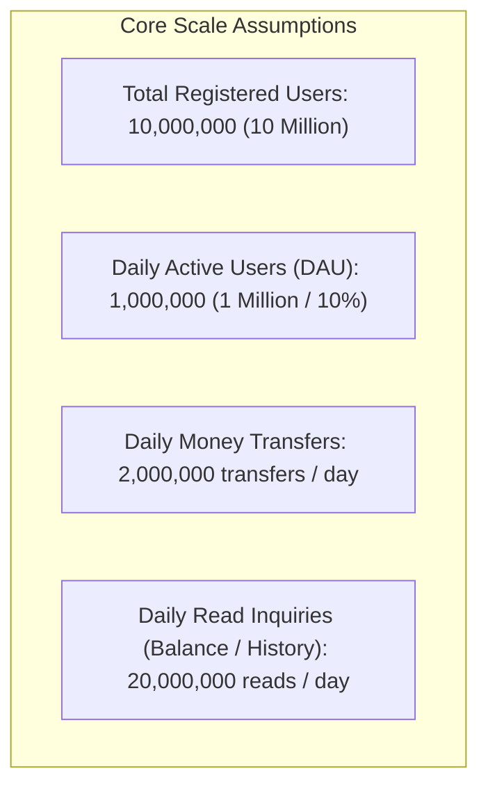
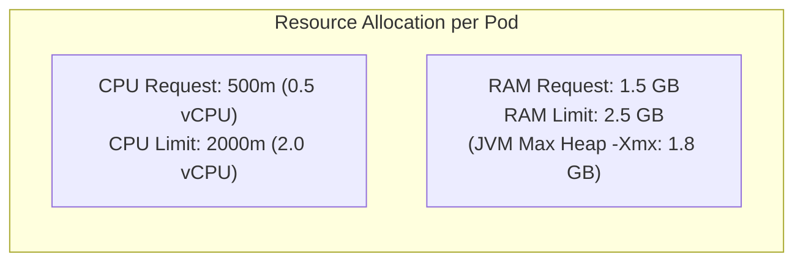
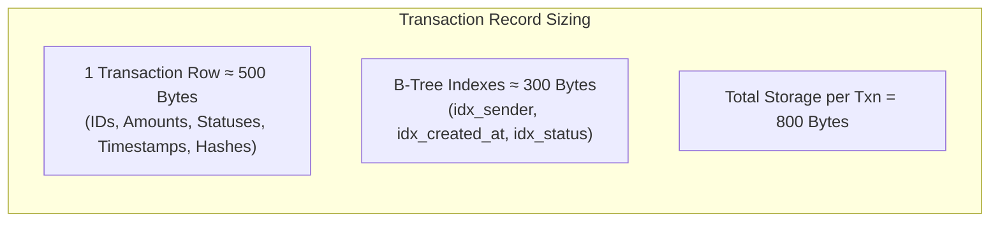
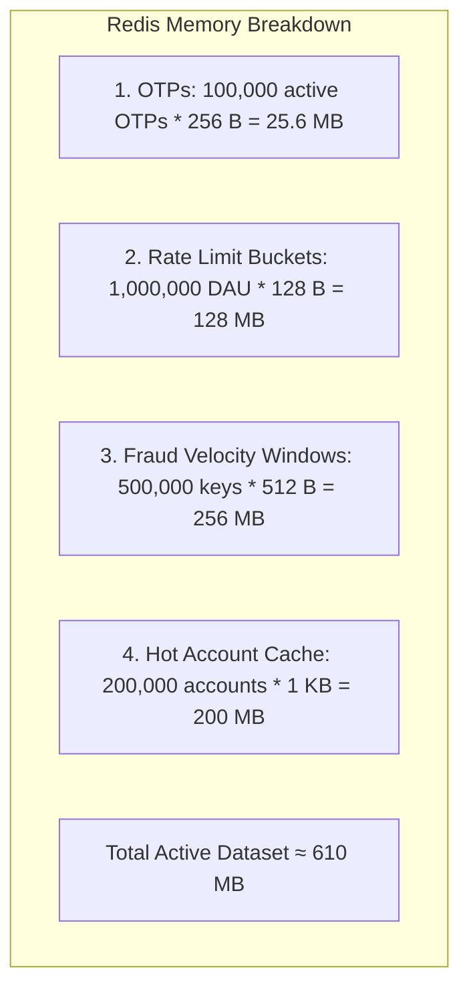
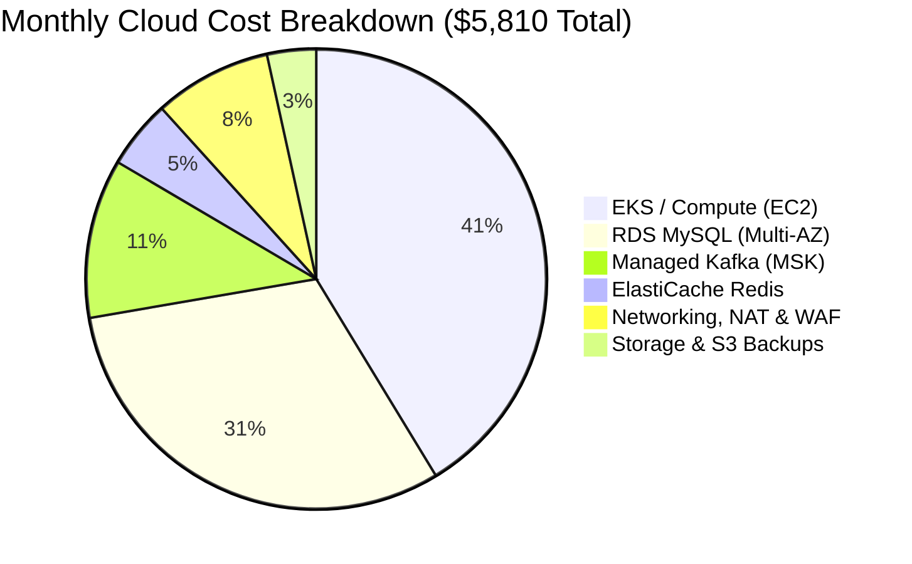

# 08 — Capacity Planning & Cost Estimation

## 8.1 Traffic & Scale Assumptions

Capacity planning grounds system architecture in mathematical reality. Below are the design targets for a tier-2 digital banking system:

### Throughput & QPS Derivation

$$\text{Average Write QPS} = \frac{2{,}000{,}000 \text{ transfers}}{86{,}400 \text{ seconds}} \approx 23.1 \text{ transfers/sec}$$

$$\text{Peak Write QPS (Peak Factor = 5x)} = 23.1 \times 5 \approx 115 \text{ transfers/sec}$$

$$\text{Stress Target (Marketing Surge / Salary Day = 10x)} = 23.1 \times 10 \approx \mathbf{250 \text{ to } 1{,}000 \text{ TPS}}$$

$$\text{Average Read QPS} = \frac{20{,}000{,}000 \text{ reads}}{86{,}400 \text{ seconds}} \approx 231 \text{ queries/sec}$$

$$\text{Peak Read QPS (5x)} \approx \mathbf{1{,}155 \text{ queries/sec}}$$

---

## 8.2 Compute Sizing (CPU & RAM)

Each Spring Boot microservice runs in an optimized JVM container with specified resource limits.

### Pod Capacity & Sizing Formula
- One `transaction-service` pod (2 vCPU, 2GB RAM) comfortably handles **150 concurrent transactions/sec** with $< 200\text{ms}$ latency.
- To handle peak stress of **1,000 TPS** with $N+2$ redundancy:
  $$\text{Required Pods} = \left\lceil \frac{1000 \text{ TPS}}{150 \text{ TPS/pod}} \right\rceil + 2 = 7 + 2 = \mathbf{9 \text{ Pods}}$$

### Cluster Sizing Matrix (Production Baseline)

| Service Name | Base Pods | Peak Pods | Total vCPUs (Peak) | Total RAM (Peak) |
|---|---|---|---|---|
| **API Gateway** | 3 | 8 | 8 vCPU | 16 GB |
| **Transaction Service** | 4 | 10 | 20 vCPU | 25 GB |
| **Account Service** | 3 | 8 | 16 vCPU | 20 GB |
| **Payment Service** | 2 | 4 | 8 vCPU | 10 GB |
| **Fraud Detection Service** | 3 | 8 | 16 vCPU | 20 GB |
| **Notification Service** | 2 | 5 | 5 vCPU | 10 GB |
| **Total Service Compute** | **17** | **43** | **73 vCPUs** | **101 GB** |

- **Node Pool**: Sized at **6x AWS `m6i.2xlarge`** instances (8 vCPU, 32 GB RAM each) = 48 vCPU, 192 GB RAM baseline (with autoscaling to 10 nodes during peak).

---

## 8.3 Storage Sizing: Database & Kafka

### 1. MySQL Storage Growth (Relational Tier)

$$\text{Daily Growth} = 2{,}000{,}000 \text{ txns} \times 800 \text{ Bytes} \approx 1.6 \text{ GB / day}$$

$$\text{Yearly Growth} = 1.6 \text{ GB} \times 365 \approx 584 \text{ GB / year}$$

$$\text{5-Year Hot Storage (Before Archival)} = 584 \text{ GB} \times 5 \approx \mathbf{2.92 \text{ TB}}$$

- **Storage Provisioning**:
  - `account_db`: 200 GB AWS gp3 SSD (Accounts grow slowly; 10M rows $\times$ 1 KB $\approx$ 10 GB).
  - `transaction_db`: 1 TB AWS gp3 SSD with auto-expand enabled up to 3 TB.
  - Read Replicas: 2x 1 TB gp3 SSDs.

### 2. Kafka Message Log Storage
- **Event Retention Policy**: 7 days buffer in Kafka before deletion.
- **Total Daily Events**: 2M transactions $\times$ 4 events/transaction (Initiated, Fraud-Checked, Completed, Notified) = 8,000,000 events/day.
- **Event Size**: $\approx 1 \text{ KB}$ JSON payload.
$$\text{Daily Kafka Storage} = 8{,}000{,}000 \times 1 \text{ KB} = 8 \text{ GB / day}$$
$$\text{7-Day Retention Storage} = 8 \text{ GB} \times 7 \text{ days} = 56 \text{ GB}$$
- **Kafka With 3x Replication**: $56 \text{ GB} \times 3 = \mathbf{168 \text{ GB}}$ total broker disk space required.

---

## 8.4 Memory & Cache Sizing (Redis)

- **Sizing with Overhead & Buffers**:
  $$\text{Target Redis Memory} = 610 \text{ MB} \times 3 \text{ (Peak safety factor)} \approx \mathbf{1.83 \text{ GB}}$$
- **Redis Cluster Provisioning**:
  - 3x AWS `cache.m6g.large` (6.38 GB RAM each) in Multi-AZ configuration. Provides $> 3\times$ headroom for sudden thundering herd traffic.

---

## 8.5 Network & Bandwidth Sizing

- **Average Inbound Payload**: 2 KB (Headers, Auth Token, Body).
- **Average Outbound Payload**: 3 KB (Headers, Account JSON response).
- **Peak Throughput**: 1,200 requests/sec total (Reads + Writes).

$$\text{Peak Ingress Bandwidth} = 1{,}200 \times 2 \text{ KB} \times 8 \text{ bits} \approx 19.2 \text{ Mbps}$$

$$\text{Peak Egress Bandwidth} = 1{,}200 \times 3 \text{ KB} \times 8 \text{ bits} \approx 28.8 \text{ Mbps}$$

- **Assessment**: Modern cloud network links easily support 10 Gbps; standard 1 Gbps networking provides abundant headroom.

---

## 8.6 Estimated Monthly Cloud Cost (AWS Baseline)

| Component | AWS Resource Specification | Quantity | Estimated Cost / Month |
|---|---|---|---|
| **EKS Cluster** | Control Plane + 6x `m6i.2xlarge` Worker Nodes | 1 cluster, 6 nodes | $1,800 + $600 = **$2,400** |
| **Databases** | RDS MySQL `db.r6g.xlarge` (Multi-AZ, 1TB gp3) | 2 instances (acc + txn) | **$1,800** |
| **Kafka** | Amazon MSK `kafka.m5.large` (3 Brokers, Multi-AZ) | 3 brokers | **$650** |
| **Cache** | ElastiCache Redis `cache.m6g.large` (Multi-AZ) | 2 nodes (1 primary, 1 replica) | **$280** |
| **Security & Edge** | AWS WAF, Route 53, ALB, NAT Gateways | Managed | **$480** |
| **Object Storage** | S3 Standard (Snapshots) + S3 Glacier (Cold Archive) | 5 TB total | **$200** |
| **Total Monthly** | | | **~$5,810 / month** |

- **Cost per Transaction**:
  $$\frac{\$5{,}810}{60{,}000{,}000 \text{ txns/month}} \approx \mathbf{\$0.000096 \text{ per transaction}}$$
  *(Less than 1/100th of a cent per transaction — exceptionally cost-efficient architecture).*
