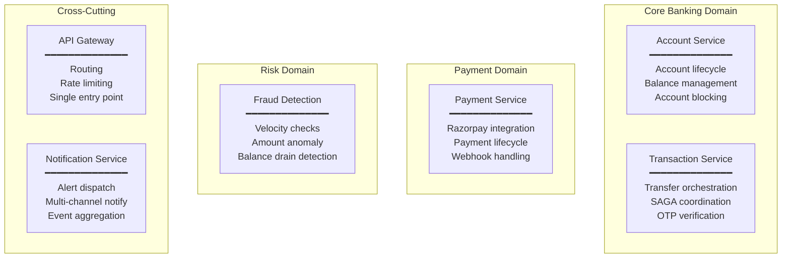
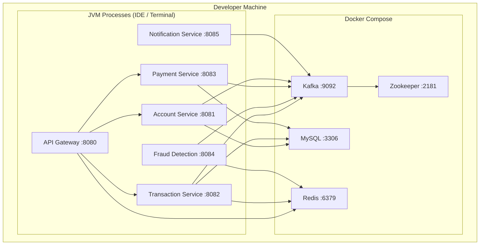
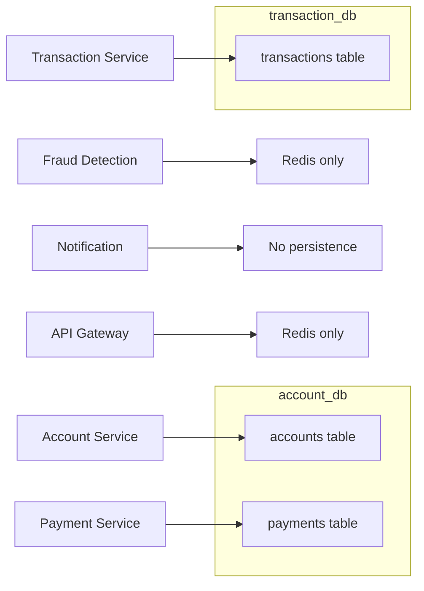

# 01 — System Overview

## 1.1 Architecture Style: Microservices + Event-Driven

This system uses a **choreography-based microservices architecture** with an **event-driven backbone**.

### Why Microservices (Not Monolith)?

| Concern | Monolith Problem | Microservice Solution |
|---|---|---|
| **Scaling** | Entire app scales together, wasting resources | Scale only the hot service (e.g., transaction-service during peak hours) |
| **Deployment** | Single deployment = single point of failure | Deploy services independently with zero downtime |
| **Team Ownership** | One large codebase = merge conflicts, slow builds | Each team owns a service end-to-end |
| **Technology Flexibility** | Locked to one stack | Each service can evolve independently |
| **Fault Isolation** | One bug crashes everything | Fraud detection crash doesn't stop account creation |

### Why Event-Driven (Not Pure REST)?

| Concern | Synchronous REST Problem | Event-Driven Solution |
|---|---|---|
| **Coupling** | Service A must know Service B's URL and API contract | Service A publishes event; whoever cares, subscribes |
| **Availability** | If B is down, A fails | Events are persisted in Kafka; B processes when it recovers |
| **Scalability** | B becomes bottleneck | Multiple consumers can process in parallel |
| **Auditability** | Request logs are scattered | Kafka topics serve as an immutable audit log |

---

## 1.2 Service Decomposition Rationale

Each service is decomposed along a **business capability boundary** — the fundamental rule of Domain-Driven Design (DDD).



### Why These Exact Boundaries?

| Service | Business Capability | Why Separate? |
|---|---|---|
| **Account Service** | Account lifecycle | Accounts exist independently of transactions. Different regulatory requirements. Different data retention policies. |
| **Transaction Service** | Money movement | Most complex business logic (SAGA). Highest throughput requirements. Needs independent scaling. |
| **Payment Service** | External payment processing | Third-party dependency (Razorpay). Different failure modes. Can be swapped for Stripe without touching other services. |
| **Fraud Detection** | Risk assessment | Evolves independently (ML models, new rules). Should not slow down the happy path. Stateless computation. |
| **Notification Service** | User communication | Channel-agnostic (email, SMS, push). Independent retry/delivery guarantees. No business logic. |
| **API Gateway** | Edge routing | Cross-cutting concern. Rate limiting. Future: authentication, load balancing, circuit breaking. |

---

## 1.3 Tech Stack Justification

### Spring Boot 4.1.0

| Decision | Reasoning |
|---|---|
| **Spring Boot** over raw Spring | Auto-configuration, embedded server, production-ready defaults |
| **Version 4.1.0** | Latest LTS with Jakarta EE migration, virtual threads support, improved observability |
| **Java 17** | LTS release, sealed classes, pattern matching, text blocks, records |

### Apache Kafka (Not RabbitMQ / ActiveMQ)

| Requirement | Kafka Advantage |
|---|---|
| **Event replay** | Kafka retains messages; consumers can re-read from any offset |
| **High throughput** | Designed for millions of events/second |
| **Ordering guarantees** | Per-partition ordering ensures transaction events process in sequence |
| **Consumer groups** | Multiple services consume the same topic independently |
| **Durability** | Replicated, fault-tolerant log storage |

### MySQL (Not PostgreSQL / MongoDB)

| Requirement | MySQL Fit |
|---|---|
| **ACID transactions** | Banking requires strict consistency — MySQL InnoDB provides full ACID |
| **Relational data** | Accounts, transactions, payments are inherently relational |
| **Ecosystem maturity** | Proven in financial services for decades |
| **JPA compatibility** | Hibernate + MySQL is the most battle-tested combination |

### Redis (Not Memcached)

| Use Case | Why Redis |
|---|---|
| **OTP storage** (TTL) | Native key expiration (`EXPIRE` command) |
| **Fraud velocity counters** | Atomic `INCR` with TTL for sliding window counting |
| **Rate limiting** (Gateway) | Redis-backed token bucket algorithm via Spring Cloud Gateway |
| **Data structures** | Strings, hashes, sorted sets — more versatile than Memcached |

### OpenFeign (Not RestTemplate / WebClient)

| Requirement | Feign Advantage |
|---|---|
| **Declarative HTTP clients** | Interface + annotations — zero boilerplate |
| **Spring Cloud integration** | Service discovery, load balancing, circuit breaking out of the box |
| **Contract clarity** | The Feign interface IS the API contract |

---

## 1.4 Deployment Topology



### Network Configuration

All Docker containers communicate on a shared `banking-network` (bridge driver). Spring Boot services run on the host machine and connect to containers via `localhost` mapped ports.

| Component | Internal Port | Host Mapping | Connection String |
|---|---|---|---|
| MySQL | 3306 | localhost:3306 | `jdbc:mysql://localhost:3306/{db_name}` |
| Redis | 6379 | localhost:6379 | `spring.data.redis.host=localhost` |
| Kafka | 29092 (internal) | localhost:9092 | `spring.kafka.bootstrap-servers=localhost:9092` |
| Zookeeper | 2181 | — (internal only) | Used only by Kafka broker |

---

## 1.5 Communication Patterns

This system uses two distinct communication styles, chosen deliberately based on the nature of each interaction.

### Synchronous (Feign HTTP)

Used when the **caller needs an immediate response** to proceed.

```
Transaction Service --[deductBalance]--> Account Service
Transaction Service --[creditBalance]--> Account Service  (SAGA compensation)
Fraud Detection     --[getBalance]-----> Account Service
```

**Why synchronous here?**
- Transfer cannot proceed without confirming deduction succeeded
- Fraud check needs balance value to make a decision
- SAGA compensation must confirm refund before marking transaction as FLAGGED

### Asynchronous (Kafka Events)

Used when the **caller doesn't need to wait** for the result.

```
Transaction Service --[transaction.initiated]---> Fraud Detection
Fraud Detection     --[fraud.check.clean]-------> Transaction Service
Fraud Detection     --[verification.required]---> Transaction Service
Transaction Service --[transaction.completed]---> Account Service + Notification
Payment Service     --[payment.completed]-------> Notification
```

**Why asynchronous here?**
- Fraud checking can take variable time — don't block the API response
- Notifications are fire-and-forget — user doesn't wait for email delivery
- Account crediting (receiver) can happen eventually — sender already got confirmation

---

## 1.6 Data Ownership

Each service owns its data exclusively. No service directly accesses another service's database.



> **Note:** Account Service and Payment Service currently share `account_db`. In a stricter decomposition, Payment Service would have its own `payment_db`. This is an acceptable trade-off for early-stage development.

---

## 1.7 Service Startup Order

Due to infrastructure dependencies, services should be started in this order:

```
1. docker-compose up          (MySQL, Redis, Kafka, Zookeeper)
2. Account Service   :8081    (MySQL must be ready)
3. Transaction Service :8082  (MySQL + Redis + Kafka must be ready)
4. Payment Service   :8083    (MySQL + Kafka must be ready)
5. Fraud Detection   :8084    (Redis + Kafka must be ready)
6. Notification      :8085    (Kafka must be ready)
7. API Gateway       :8080    (Redis must be ready; downstream services should be up)
```
