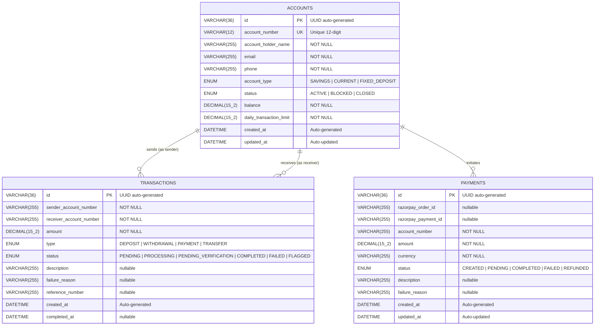
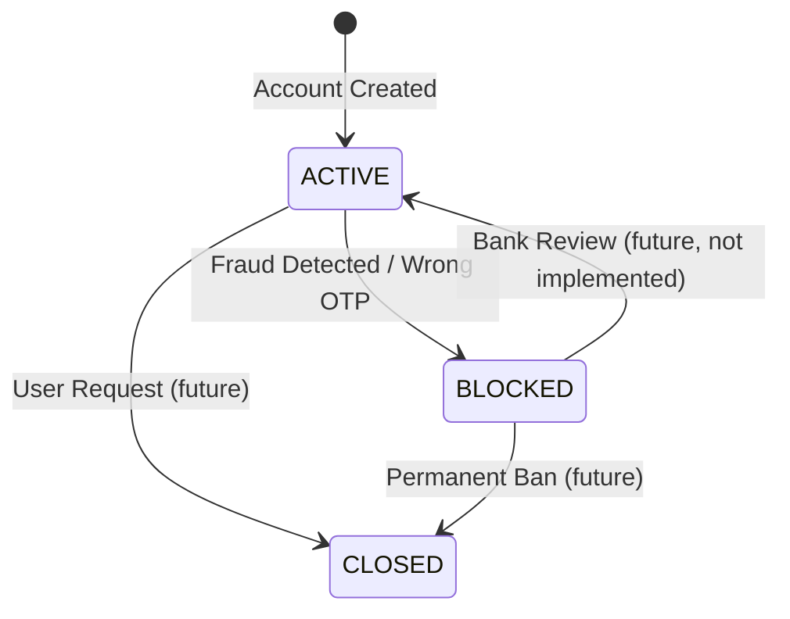
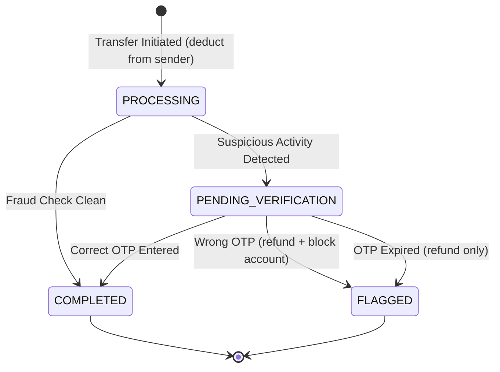
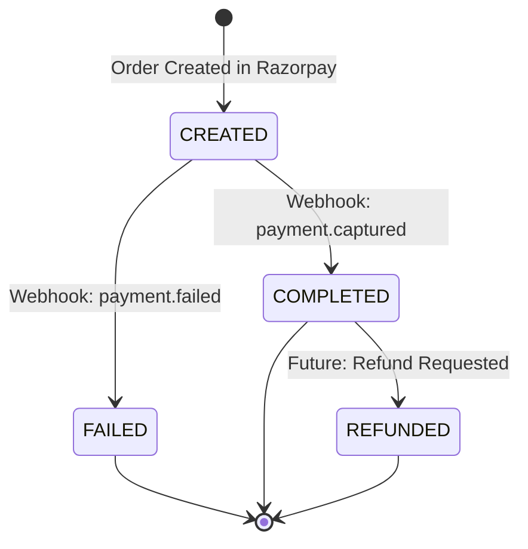
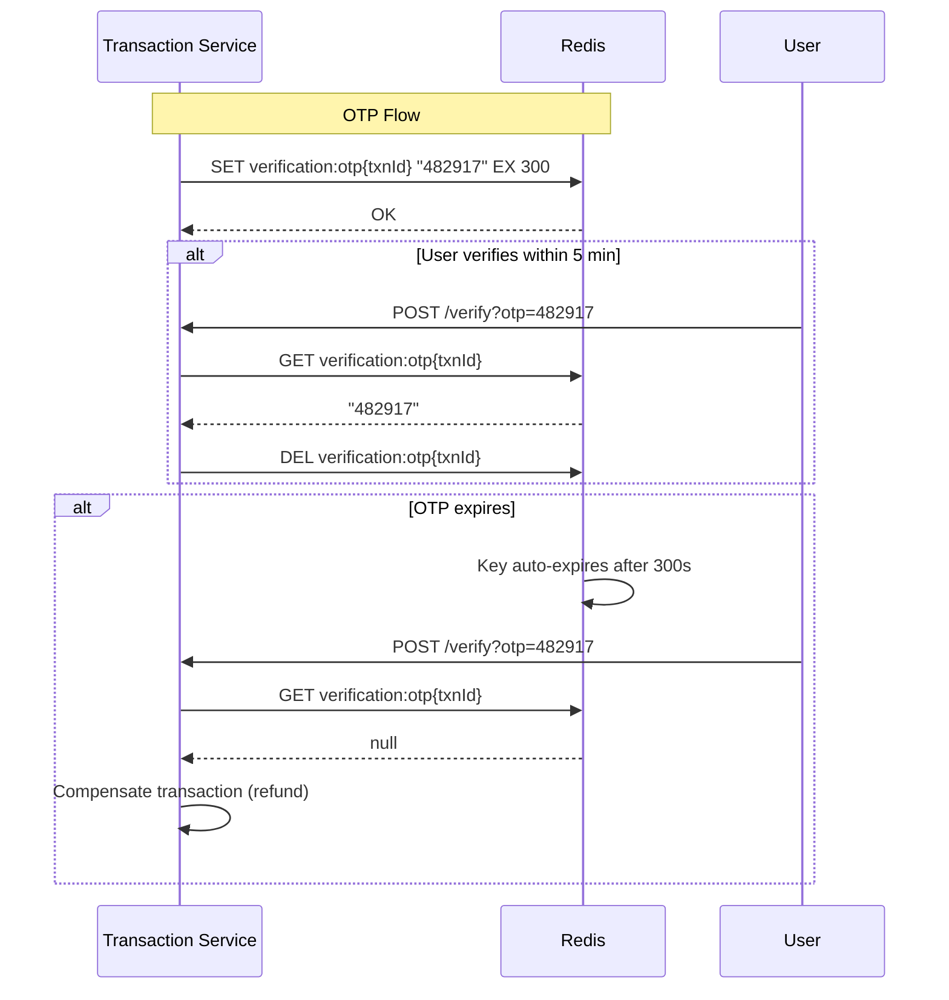
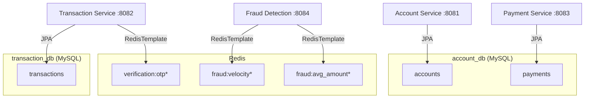

# 02 — Database Design

## 2.1 Entity-Relationship Diagram



> **Important:** These relationships are **logical, not enforced by foreign keys**. Since Account and Transaction live in different databases (`account_db` vs `transaction_db`), referential integrity is maintained at the **application level** via Feign calls and Kafka events. This is a fundamental trade-off in microservice architecture.

---

## 2.2 Table: `accounts` (Database: `account_db`)

### Schema Definition

```sql
CREATE TABLE accounts (
    id                      VARCHAR(36)    NOT NULL PRIMARY KEY,  -- UUID
    account_number          VARCHAR(12)    NOT NULL UNIQUE,
    account_holder_name     VARCHAR(255)   NOT NULL,
    email                   VARCHAR(255)   NOT NULL,
    phone                   VARCHAR(255)   NOT NULL,
    account_type            ENUM('SAVINGS', 'CURRENT', 'FIXED_DEPOSIT') NOT NULL,
    status                  ENUM('ACTIVE', 'BLOCKED', 'CLOSED')         NOT NULL,
    balance                 DECIMAL(15, 2) NOT NULL,
    daily_transaction_limit DECIMAL(15, 2) NOT NULL,
    created_at              DATETIME(6),
    updated_at              DATETIME(6)
) ENGINE=InnoDB DEFAULT CHARSET=utf8mb4;
```

### Column-by-Column Rationale

| Column | Type | Why This Type? | Design Decision |
|---|---|---|---|
| `id` | `VARCHAR(36)` / UUID | UUIDs prevent enumeration attacks. Sequential IDs leak business volume. | JPA `@GeneratedValue(strategy = GenerationType.UUID)` |
| `account_number` | `VARCHAR(12)` | 12-digit number like a real bank account. Human readable, easy to communicate verbally. | Generated via `SecureRandom`, uniqueness guaranteed by retry loop |
| `account_holder_name` | `VARCHAR(255)` | Supports international names (accents, long names) | NOT NULL — every account must have an owner |
| `email` | `VARCHAR(255)` | Used for notifications and as uniqueness constraint (one account per email) | Application-level unique check via `existsByEmail()` |
| `phone` | `VARCHAR(255)` | VARCHAR not INT — phone numbers have leading zeros, country codes, special chars | Stored as-is from user input |
| `account_type` | `ENUM` | Fixed set of values. MySQL ENUM is storage-efficient (1-2 bytes) | Maps to Java `AccountType` enum via `@Enumerated(EnumType.STRING)` |
| `status` | `ENUM` | State machine with 3 states | `STRING` storage (not ordinal) for readability in raw SQL queries |
| `balance` | `DECIMAL(15,2)` | 15 digits total, 2 decimal places. Supports up to ₹9,999,999,999,999.99 | `BigDecimal` in Java — NEVER use `float`/`double` for money |
| `daily_transaction_limit` | `DECIMAL(15,2)` | Per-account spending limit | Auto-set: ₹100,000 (SAVINGS) or ₹500,000 (CURRENT) |
| `created_at` | `DATETIME(6)` | Microsecond precision for audit trails | Hibernate `@CreationTimestamp` — immutable after creation |
| `updated_at` | `DATETIME(6)` | Track last modification | Hibernate `@UpdateTimestamp` — auto-updated on every save |

### Account Status State Machine



### Indexes (Implicit + Recommended)

| Index | Column(s) | Type | Created By | Purpose |
|---|---|---|---|---|
| PRIMARY | `id` | Clustered | JPA `@Id` | Primary key lookup |
| UNIQUE | `account_number` | B-Tree | `@Column(unique = true)` | Account lookup, prevent duplicates |
| — (Recommended) | `email` | B-Tree | Should add `@Column(unique = true)` | Currently checked via `existsByEmail()` — full table scan without index |
| — (Recommended) | `status` | B-Tree | Manual | Filter active/blocked accounts efficiently |

---

## 2.3 Table: `transactions` (Database: `transaction_db`)

### Schema Definition

```sql
CREATE TABLE transactions (
    id                       VARCHAR(36)    NOT NULL PRIMARY KEY,
    sender_account_number    VARCHAR(255)   NOT NULL,
    receiver_account_number  VARCHAR(255)   NOT NULL,
    amount                   DECIMAL(15, 2) NOT NULL,
    type                     ENUM('DEPOSIT', 'WITHDRAWAL', 'PAYMENT', 'TRANSFER') NOT NULL,
    status                   ENUM('PENDING', 'PROCESSING', 'PENDING_VERIFICATION',
                                  'COMPLETED', 'FAILED', 'FLAGGED') NOT NULL,
    description              VARCHAR(255),
    failure_reason           VARCHAR(255),
    reference_number         VARCHAR(255),
    created_at               DATETIME(6),
    completed_at             DATETIME(6)
) ENGINE=InnoDB DEFAULT CHARSET=utf8mb4;
```

### Column-by-Column Rationale

| Column | Type | Design Decision |
|---|---|---|
| `id` | UUID | Same as accounts — prevents enumeration |
| `sender_account_number` | VARCHAR | **Not a foreign key** — lives in a different database. Validated via Feign call. |
| `receiver_account_number` | VARCHAR | Same reasoning — cross-database reference |
| `amount` | DECIMAL(15,2) | Always positive. Transfer direction is implicit (sender → receiver). |
| `type` | ENUM | Currently only `TRANSFER` is used. `DEPOSIT`, `WITHDRAWAL`, `PAYMENT` are for future use. |
| `status` | ENUM | 6-state machine — the most complex state lifecycle in the system |
| `description` | VARCHAR | User-provided transfer note (optional) |
| `failure_reason` | VARCHAR | SAGA compensation reason — populated on FLAGGED/FAILED |
| `reference_number` | VARCHAR | UUID-based reference for external tracking |
| `created_at` | DATETIME(6) | Immutable creation timestamp |
| `completed_at` | DATETIME(6) | Set only when status → COMPLETED. NULL for pending/flagged transactions. |

### Transaction Status State Machine



### Indexes

| Index | Column(s) | Created By | Purpose |
|---|---|---|---|
| PRIMARY | `id` | JPA | Primary key |
| — (Recommended) | `sender_account_number, created_at DESC` | Manual composite | `findBySenderAccountNumberOrderByCreatedAtDesc` query optimization |
| — (Recommended) | `status` | Manual | Filter by transaction state |
| — (Recommended) | `reference_number` | Manual | External reference lookup |

---

## 2.4 Table: `payments` (Database: `account_db`)

### Schema Definition

```sql
CREATE TABLE payments (
    id                   VARCHAR(36)    NOT NULL PRIMARY KEY,
    razorpay_order_id    VARCHAR(255),
    razorpay_payment_id  VARCHAR(255),
    account_number       VARCHAR(255)   NOT NULL,
    amount               DECIMAL(15, 2) NOT NULL,
    currency             VARCHAR(255)   NOT NULL,
    status               ENUM('CREATED', 'PENDING', 'COMPLETED', 'FAILED', 'REFUNDED'),
    description          VARCHAR(255),
    failure_reason       VARCHAR(255),
    created_at           DATETIME(6),
    updated_at           DATETIME(6)
) ENGINE=InnoDB DEFAULT CHARSET=utf8mb4;
```

### Column-by-Column Rationale

| Column | Type | Design Decision |
|---|---|---|
| `razorpay_order_id` | VARCHAR | Assigned after Razorpay creates the order. NULL before that. |
| `razorpay_payment_id` | VARCHAR | Assigned after Razorpay captures payment. NULL for CREATED/PENDING. |
| `account_number` | VARCHAR | Links payment to a bank account (logical reference, not FK) |
| `currency` | VARCHAR | Currently hardcoded as "USD/INR" — should be a proper ISO 4217 code |
| `status` | ENUM | 5-state lifecycle tracked from creation to completion/failure |

### Payment Status State Machine



### Indexes

| Index | Column(s) | Created By | Purpose |
|---|---|---|---|
| PRIMARY | `id` | JPA | Primary key |
| — (Recommended) | `razorpay_order_id` | Manual | Webhook lookup — `findByRazorpayOrderId()` |
| — (Recommended) | `account_number` | Manual | Payment history per account |

---

## 2.5 Redis Data Structures (No SQL Tables)

Redis is used as a **volatile data store** — no persistence guarantees needed for these use cases.

### Key-Value Design

| Service | Key Pattern | Value | TTL | Purpose |
|---|---|---|---|---|
| Transaction | `verification:otp{transactionId}` | 6-digit OTP string | 5 minutes | OTP storage for suspicious transactions |
| Fraud Detection | `fraud:velocity{accountNumber}` | Integer counter | 60 seconds | Transaction count per minute per account |
| Fraud Detection | `fraud:avg_amount{accountNumber}` | Decimal string | No TTL | Running average transaction amount |
| API Gateway | Internal (Spring Cloud) | Token bucket state | Configurable | Rate limiter state per IP |

### Redis Key Lifecycle



---

## 2.6 Database-per-Service Pattern



### Why Database-per-Service?

| Benefit | Explanation |
|---|---|
| **Loose coupling** | Schema changes in one service don't break others |
| **Independent scaling** | Transaction DB can be on a beefier server |
| **Technology freedom** | Could move fraud data to a time-series DB later |
| **Fault isolation** | Account DB crash doesn't prevent reading transaction history |

### The Trade-off: No Cross-Database Joins

You **cannot** do:
```sql
-- This is IMPOSSIBLE in microservices
SELECT t.*, a.account_holder_name
FROM transaction_db.transactions t
JOIN account_db.accounts a ON t.sender_account_number = a.account_number;
```

**Instead, you must:**
1. Query transaction-service for transactions
2. Query account-service for account details
3. Join in the application layer (API Gateway or frontend)

---

## 2.7 Why BigDecimal, Not Double?

This deserves its own section because it's a critical financial software decision.

```java
// WRONG — floating point errors
double balance = 0.1 + 0.2;  // = 0.30000000000000004

// CORRECT — exact decimal arithmetic
BigDecimal balance = new BigDecimal("0.1").add(new BigDecimal("0.2"));  // = 0.3
```

| Property | `double` | `BigDecimal` |
|---|---|---|
| Precision | ~15-17 significant digits | Arbitrary precision |
| `0.1 + 0.2` | `0.30000000000000004` | `0.3` |
| Suitable for money? | **NO** — rounding errors accumulate | **YES** — exact representation |
| JPA mapping | `DOUBLE` | `DECIMAL(15,2)` |
| Performance | Faster | Slower (acceptable for banking) |

**Rule:** In financial software, ALWAYS use `BigDecimal` in Java and `DECIMAL` in SQL.

---

## 2.8 Why UUID Primary Keys?

| Property | Auto-Increment (`BIGINT`) | UUID (`VARCHAR(36)`) |
|---|---|---|
| Predictability | Sequential → attackable (`/api/account/1`, `/api/account/2`) | Random → not guessable |
| Distributed generation | Requires coordination between DB nodes | Generated anywhere without conflicts |
| Microservice friendliness | ID collisions across services | Globally unique by design |
| URL safety | Leaks business metrics (total count) | Reveals nothing |
| Storage cost | 8 bytes | 36 bytes (4.5x larger) |
| Index performance | Better (sequential writes, B-tree friendly) | Worse (random writes, page splits) |

**Trade-off accepted:** UUID is larger and slightly slower for indexing, but the security and distributed-generation benefits are critical in a banking context.
