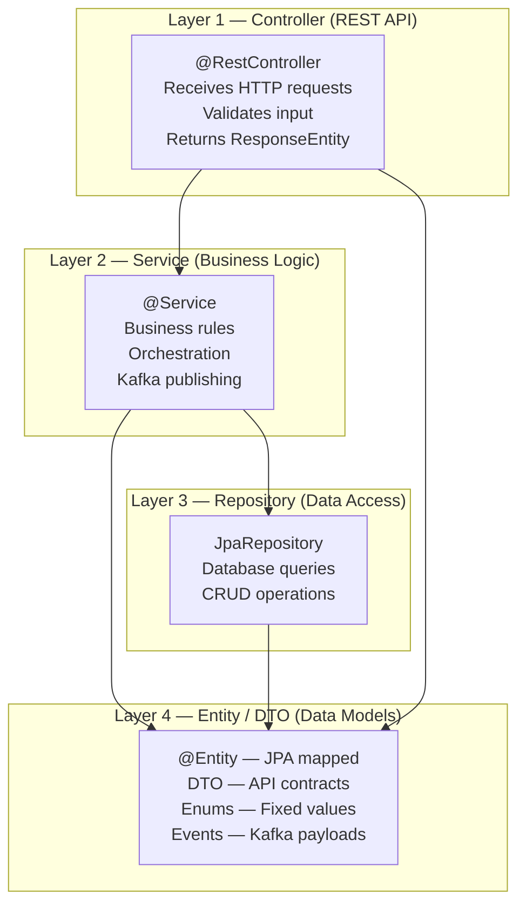
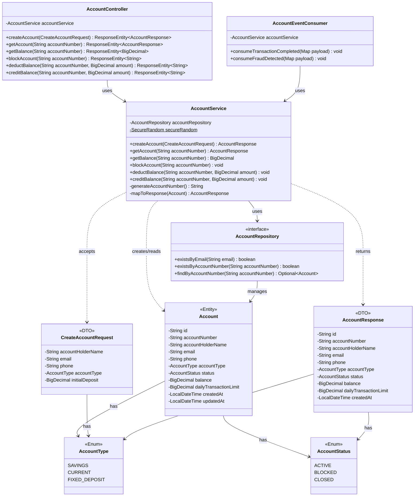
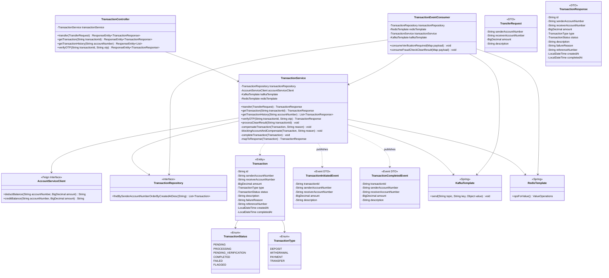
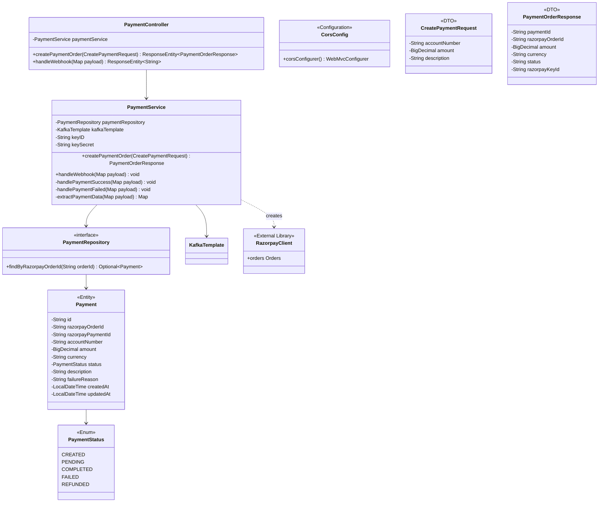
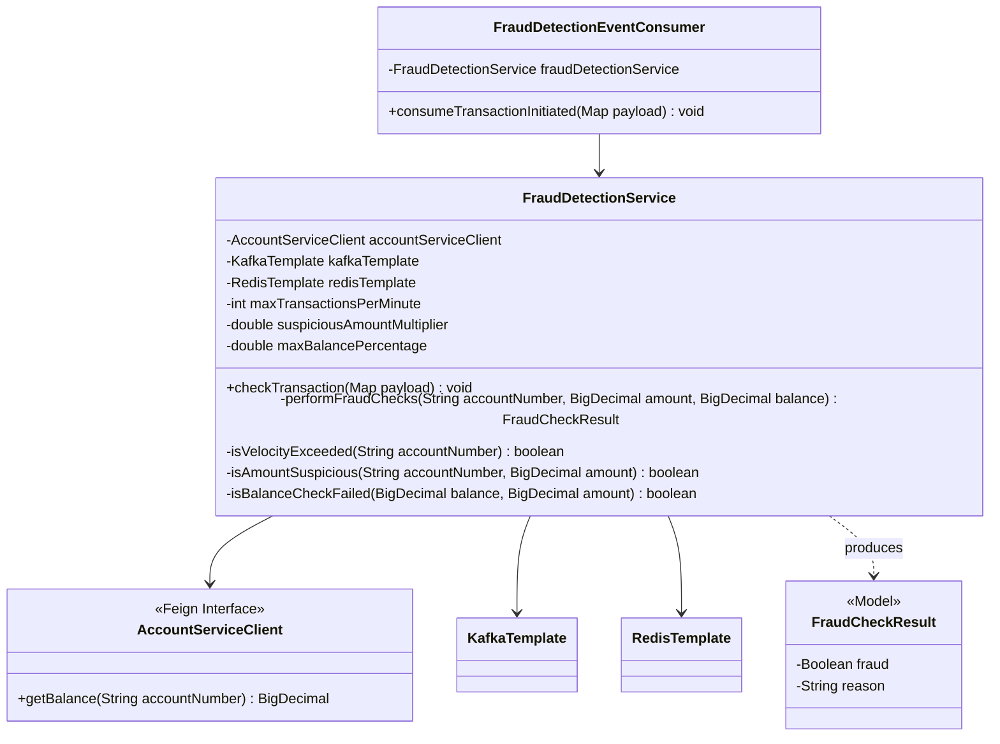
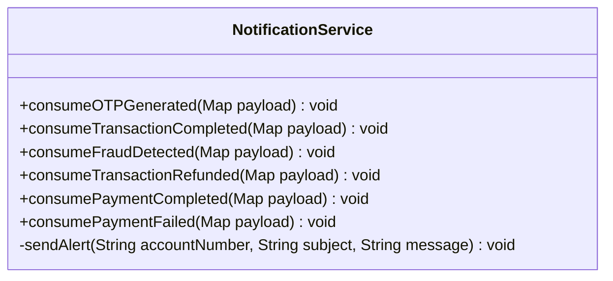
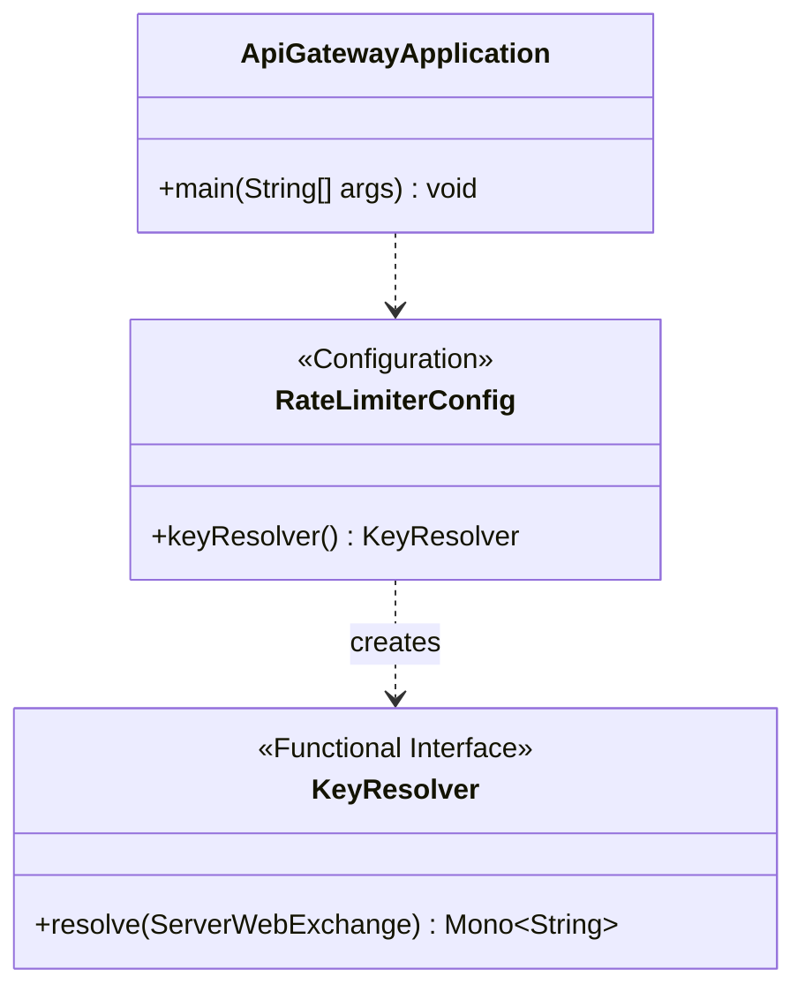
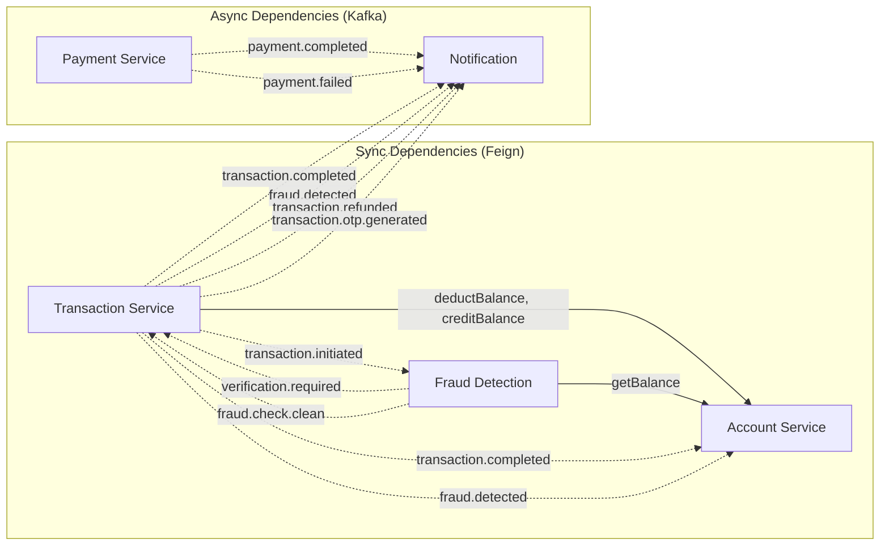

# 03 — Class Diagrams

## 3.1 Layered Architecture (Every Service Follows This)

Each microservice follows a strict **4-layer architecture**:

### Why This Layering?

| Layer | Responsibility | What It Must NOT Do |
|---|---|---|
| **Controller** | HTTP translation, validation, response formatting | Contain business logic, call repository directly |
| **Service** | Business rules, orchestration, event publishing | Know about HTTP status codes, handle JSON serialization |
| **Repository** | Data access, query execution | Contain business logic, make HTTP calls |
| **Entity/DTO** | Data structure definition | Contain behavior (pure data carriers) |

---

## 3.2 Account Service — Class Diagram

### Key Design Decisions

| Decision | Reasoning |
|---|---|
| `AccountEventConsumer` is separate from `AccountService` | **Single Responsibility** — consumer handles Kafka deserialization and error handling; service handles business logic |
| `AccountRepository` is an interface | **Repository Pattern** — Spring Data JPA generates implementation at runtime |
| `CreateAccountRequest` ≠ `AccountResponse` | **Separate input/output DTOs** — input has `initialDeposit`, output has `balance`, `id`, `createdAt` |
| `mapToResponse()` is private | **Encapsulation** — mapping logic is an internal implementation detail |
| `generateAccountNumber()` uses `SecureRandom` | **Security** — `Math.random()` is predictable; `SecureRandom` is cryptographically secure |

---

## 3.3 Transaction Service — Class Diagram

### Key Design Decisions

| Decision | Reasoning |
|---|---|
| 4 dependencies in `TransactionService` | SAGA orchestrator needs: DB (state), Feign (sync calls), Kafka (async events), Redis (OTP) |
| `compensateTransaction()` is private | Compensation is internal SAGA logic — never called externally |
| `TransactionEventConsumer` is separate | Separates event consumption (infrastructure) from business logic (service) |
| Event classes mirror `Transaction` entity | Events carry only the data consumers need — no internal fields like `failureReason` |
| `processCleanResult()` is public | Called by `TransactionEventConsumer` — must be accessible but not via HTTP |

---

## 3.4 Payment Service — Class Diagram

---

## 3.5 Fraud Detection Service — Class Diagram

### Key Design Decisions

| Decision | Reasoning |
|---|---|
| No REST controller | Fraud detection is event-driven only — triggered by Kafka, not HTTP |
| No JPA / Database | Stateless service — uses Redis for transient counters and Feign for lookups |
| Configurable thresholds via `@Value` | Fraud rules can be tuned via `application.yaml` without code changes |
| `FraudCheckResult` is a simple POJO | Not an entity — never persisted. Just a method return type. |
| 3 independent checks | Each check is a separate private method — easy to add/remove rules |

---

## 3.6 Notification Service — Class Diagram

### Key Design Decision

The Notification Service is the **simplest** in the system — intentionally. It has:
- No controller (no REST API)
- No repository (no database)
- No entity (no persistence)
- No Feign client (no sync calls)

It is a **pure Kafka consumer** that transforms events into human-readable alerts. Currently logs to console; designed to be replaced with email/SMS/push notification providers.

---

## 3.7 API Gateway — Class Diagram

### Key Design Decision

The gateway is **configuration-driven**, not code-driven. Routes are defined in `application.yaml`, not in Java. The only Java code is the `RateLimiterConfig` which tells Spring Cloud Gateway to rate-limit by client IP address.

---

## 3.8 Cross-Service Dependency Map

**Key Insight:** Account Service is the most depended-upon service. If it goes down, transfers and fraud checks fail. This makes it the most critical service to keep highly available.
