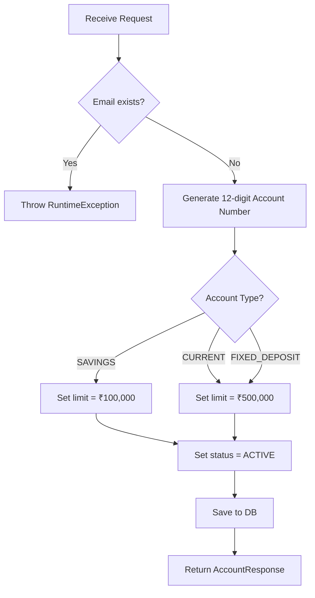
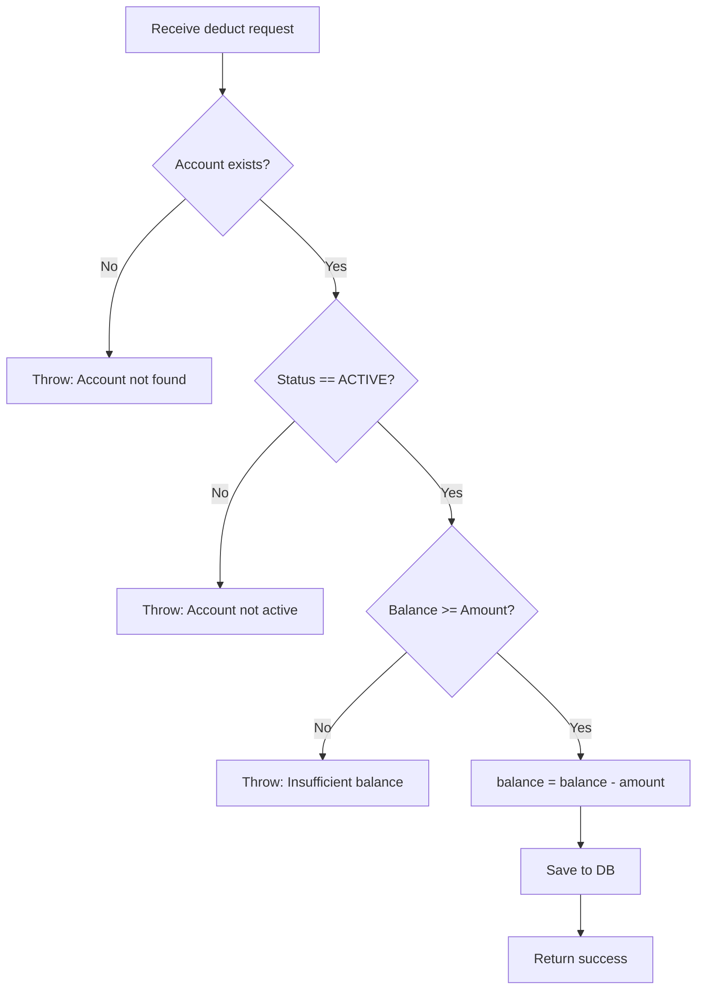
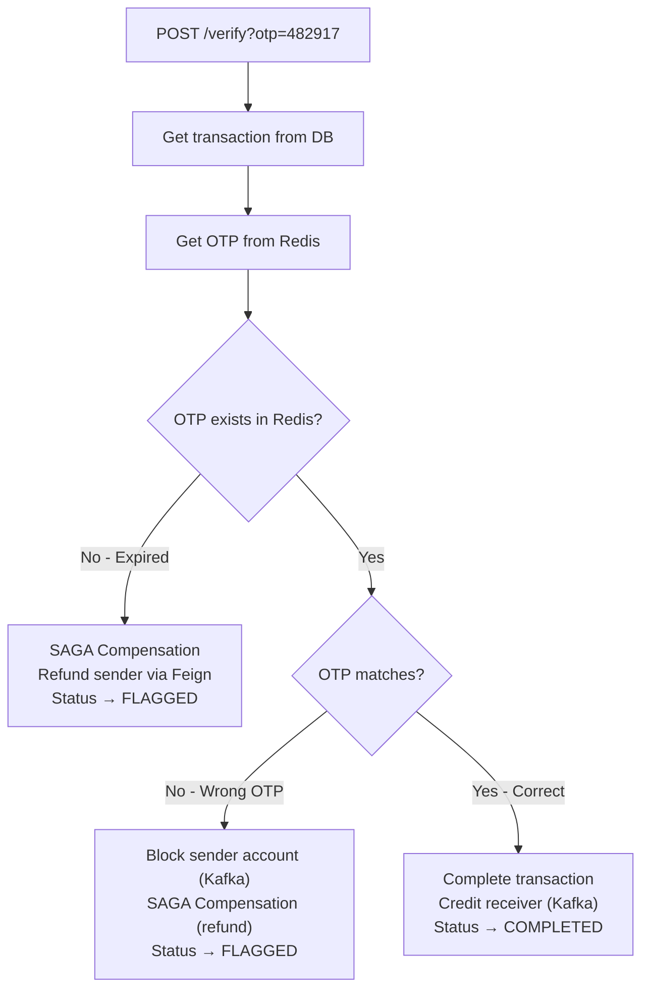

# 04 — API Design

## 4.1 API Design Principles

| Principle | Implementation |
|---|---|
| **RESTful naming** | Nouns for resources (`/accounts`, `/transactions`), HTTP verbs for actions |
| **Versioned** | All APIs prefixed with `/api/v1/` |
| **Validated** | Jakarta Bean Validation (`@NotBlank`, `@Positive`, `@Email`) |
| **Consistent responses** | `ResponseEntity<T>` with proper HTTP status codes |
| **Gateway-routed** | All external traffic flows through API Gateway on `:8080` |

---

## 4.2 Account Service APIs

### `POST /api/v1/accounts` — Create Account

**Purpose:** Register a new bank account.

**Request:**
```json
{
    "accountHolderName": "Samarth Sharma",
    "email": "samarth@example.com",
    "phone": "+91-9876543210",
    "accountType": "SAVINGS",
    "initialDeposit": 50000.00
}
```

**Validation Rules:**

| Field | Rule | Annotation | Error Message |
|---|---|---|---|
| `accountHolderName` | Required, non-blank | `@NotBlank` | "Account Holder Name is required" |
| `email` | Required, valid email format | `@NotBlank` + `@Email` | "Wrong email format" |
| `phone` | Required, non-blank | `@NotBlank` | "Phone number is required" |
| `accountType` | Required, must be enum value | `@NotNull` | "Account Type is required" |
| `initialDeposit` | Required, must be > 0 | `@NotNull` + `@Positive` | "Initial Deposit must be positive" |

**Success Response:** `201 CREATED`
```json
{
    "id": "a1b2c3d4-e5f6-7890-abcd-ef1234567890",
    "accountNumber": "482917365014",
    "accountHolderName": "Samarth Sharma",
    "email": "samarth@example.com",
    "phone": "+91-9876543210",
    "accountType": "SAVINGS",
    "status": "ACTIVE",
    "balance": 50000.00,
    "dailyTransactionLimit": 100000.00,
    "createdAt": "2026-09-12T14:30:00"
}
```

**Error Responses:**

| Status | Condition | Body |
|---|---|---|
| `400` | Validation failure | Spring default validation error |
| `500` | Duplicate email | `RuntimeException: "Account already exists"` |

**Business Logic Flow:**


---

### `GET /api/v1/accounts/{accountNumber}` — Get Account

**Purpose:** Retrieve account details by account number.

**Path Parameters:**

| Param | Type | Example |
|---|---|---|
| `accountNumber` | String (12-digit) | `482917365014` |

**Success Response:** `200 OK`
```json
{
    "id": "a1b2c3d4-e5f6-7890-abcd-ef1234567890",
    "accountNumber": "482917365014",
    "accountHolderName": "Samarth Sharma",
    "email": "samarth@example.com",
    "phone": "+91-9876543210",
    "accountType": "SAVINGS",
    "status": "ACTIVE",
    "balance": 50000.00,
    "dailyTransactionLimit": 100000.00,
    "createdAt": "2026-09-12T14:30:00"
}
```

**Error:** `500` if account not found (throws `RuntimeException`).

---

### `GET /api/v1/accounts/{accountNumber}/balance` — Get Balance

**Purpose:** Retrieve balance only (lighter response). Used by Fraud Detection Service via Feign.

**Success Response:** `200 OK`
```json
50000.00
```

---

### `PUT /api/v1/accounts/{accountNumber}/block` — Block Account

**Purpose:** Block an account. Called when fraud is confirmed.

**Success Response:** `200 OK`
```json
"Account Blocked Successfully"
```

**Side Effect:** Account `status` → `BLOCKED`. Future deductions will be rejected.

---

### `PUT /api/v1/accounts/{accountNumber}/deduct?amount={amount}` — Deduct Balance

**Purpose:** Deduct money from an account. Called by Transaction Service via Feign during transfers.

**Query Parameters:**

| Param | Type | Example |
|---|---|---|
| `amount` | BigDecimal | `5000.00` |

**Success Response:** `200 OK`
```json
"Balance deducted Successfully"
```

**Validation Flow:**


---

### `PUT /api/v1/accounts/{accountNumber}/credit?amount={amount}` — Credit Balance

**Purpose:** Add money to an account. Called in two scenarios:
1. Transaction completed → credit receiver
2. SAGA compensation → refund sender

**Success Response:** `200 OK`
```json
"Balance credited Successfully"
```

**Note:** No validation on account status — even blocked accounts can receive refunds.

---

## 4.3 Transaction Service APIs

### `POST /api/v1/transactions/transfer` — Initiate Transfer

**Purpose:** SAGA Step 1 — Start a money transfer between two accounts.

**Request:**
```json
{
    "senderAccountNumber": "482917365014",
    "receiverAccountNumber": "719283650471",
    "amount": 5000.00,
    "description": "Rent payment for September"
}
```

**Validation Rules:**

| Field | Rule | Annotation | Error Message |
|---|---|---|---|
| `senderAccountNumber` | Required | `@NotBlank` | "sender account number is required" |
| `receiverAccountNumber` | Required | `@NotBlank` | "receiver account number is required" |
| `amount` | Required, > 0 | `@NotNull` + `@Positive` | "amount must be positive" |
| `description` | Optional | — | — |

**Success Response:** `201 CREATED`
```json
{
    "id": "f7e8d9c0-b1a2-3456-7890-123456789abc",
    "senderAccountNumber": "482917365014",
    "receiverAccountNumber": "719283650471",
    "amount": 5000.00,
    "type": "TRANSFER",
    "status": "PROCESSING",
    "description": "Rent payment for September",
    "failureReason": null,
    "referenceNumber": "e4d3c2b1-a098-7654-3210-fedcba987654",
    "createdAt": "2026-09-12T15:00:00",
    "completedAt": null
}
```

**What Happens Behind the Scenes:**
1. Feign call → deduct from sender's account (synchronous)
2. Save transaction with status `PROCESSING`
3. Publish `transaction.initiated` event to Kafka
4. Return response immediately (non-blocking)

---

### `GET /api/v1/transactions/{transactionId}` — Get Transaction

**Purpose:** Look up a specific transaction by its UUID.

**Success Response:** `200 OK` — same schema as transfer response above.

---

### `GET /api/v1/transactions/account/{accountNumber}` — Transaction History

**Purpose:** Get all transactions where the given account is the **sender**, ordered by most recent first.

**Success Response:** `200 OK`
```json
[
    {
        "id": "...",
        "senderAccountNumber": "482917365014",
        "receiverAccountNumber": "719283650471",
        "amount": 5000.00,
        "type": "TRANSFER",
        "status": "COMPLETED",
        "createdAt": "2026-09-12T15:00:00",
        "completedAt": "2026-09-12T15:00:05"
    },
    {
        "id": "...",
        "senderAccountNumber": "482917365014",
        "receiverAccountNumber": "382947561023",
        "amount": 1000.00,
        "type": "TRANSFER",
        "status": "FLAGGED",
        "failureReason": "Wrong OTP entered - SAGA compensation executed",
        "createdAt": "2026-09-12T14:00:00",
        "completedAt": null
    }
]
```

**Note:** Only returns transactions where the account is the **sender**. Receiver-side history would require a separate query (not implemented).

---

### `POST /api/v1/transactions/{transactionId}/verify?otp={otp}` — Verify OTP

**Purpose:** Complete a suspicious transaction by providing the correct OTP.

**Query Parameters:**

| Param | Type | Example |
|---|---|---|
| `otp` | String (6-digit) | `482917` |

**Three Possible Outcomes:**



| Scenario | Final Status | Account Effect | Kafka Events |
|---|---|---|---|
| Correct OTP | `COMPLETED` | Receiver credited | `transaction.completed` |
| Wrong OTP | `FLAGGED` | Sender refunded + blocked | `fraud.detected` + `transaction.refunded` |
| OTP expired | `FLAGGED` | Sender refunded | `transaction.refunded` |

---

## 4.4 Payment Service APIs

### `POST /api/v1/payments/create-order` — Create Payment Order

**Purpose:** Create a Razorpay order for frontend checkout integration.

**Request:**
```json
{
    "accountNumber": "482917365014",
    "amount": 2500.00,
    "description": "Premium subscription"
}
```

**Success Response:** `201 CREATED`
```json
{
    "paymentId": "p1a2b3c4-d5e6-7890-abcd-ef1234567890",
    "razorpayOrderId": "order_ABC123XYZ",
    "amount": 2500.00,
    "currency": "USD/INR",
    "status": "CREATED",
    "razorpayKeyId": "rzp_test_jhwgsjchdb"
}
```

**Flow:**
1. Create `RazorpayClient` with keyId + keySecret
2. Convert amount to paise (multiply by 100)
3. Call Razorpay API to create order
4. Save `Payment` entity with `CREATED` status
5. Return order details for frontend Razorpay checkout widget

---

### `POST /api/v1/payments/webhook` — Razorpay Webhook

**Purpose:** Callback endpoint called by Razorpay when payment succeeds or fails.

**Incoming Payload (from Razorpay):**
```json
{
    "event": "payment.captured",
    "payload": {
        "payment": {
            "entity": {
                "id": "pay_ABC123",
                "order_id": "order_ABC123XYZ",
                "amount": 250000,
                "currency": "INR"
            }
        }
    }
}
```

**Handled Events:**

| Razorpay Event | Action | Kafka Topic Published |
|---|---|---|
| `payment.captured` | Set status → `COMPLETED`, store `razorpayPaymentId` | `payment.completed` |
| `payment.failed` | Set status → `FAILED`, record failure reason | `payment.failed` |

---

## 4.5 Feign Client Contracts (Internal APIs)

These are **not exposed externally** — they are service-to-service contracts.

### Transaction Service → Account Service

```java
@FeignClient(name = "account-service", url = "account.service.url")
public interface AccountServiceClient {

    @PutMapping("/api/v1/accounts/{accountNumber}/deduct")
    String deductBalance(@PathVariable String accountNumber,
                         @RequestParam BigDecimal amount);

    @PutMapping("/api/v1/accounts/{accountNumber}/credit")
    String creditBalance(@PathVariable String accountNumber,
                         @RequestParam BigDecimal amount);
}
```

### Fraud Detection → Account Service

```java
@FeignClient(name = "account-service", url = "account.service.url")
public interface AccountServiceClient {

    @GetMapping("/api/v1/accounts/{accountNumber}/balance")
    BigDecimal getBalance(@PathVariable String accountNumber);
}
```

---

## 4.6 Complete API Endpoint Summary

| Service | Method | Endpoint | Auth | Rate Limited |
|---|---|---|---|---|
| Account | `POST` | `/api/v1/accounts` | No | Yes (10/s) |
| Account | `GET` | `/api/v1/accounts/{accountNumber}` | No | Yes (10/s) |
| Account | `GET` | `/api/v1/accounts/{accountNumber}/balance` | No | Yes (10/s) |
| Account | `PUT` | `/api/v1/accounts/{accountNumber}/block` | No | Yes (10/s) |
| Account | `PUT` | `/api/v1/accounts/{accountNumber}/deduct` | No | Yes (10/s) |
| Account | `PUT` | `/api/v1/accounts/{accountNumber}/credit` | No | Yes (10/s) |
| Transaction | `POST` | `/api/v1/transactions/transfer` | No | Yes (10/s) |
| Transaction | `GET` | `/api/v1/transactions/{transactionId}` | No | Yes (10/s) |
| Transaction | `GET` | `/api/v1/transactions/account/{accountNumber}` | No | Yes (10/s) |
| Transaction | `POST` | `/api/v1/transactions/{transactionId}/verify` | No | Yes (10/s) |
| Payment | `POST` | `/api/v1/payments/create-order` | No | Yes (5/s) |
| Payment | `POST` | `/api/v1/payments/webhook` | No | Yes (5/s) |

**Total: 12 REST endpoints across 3 services.**
