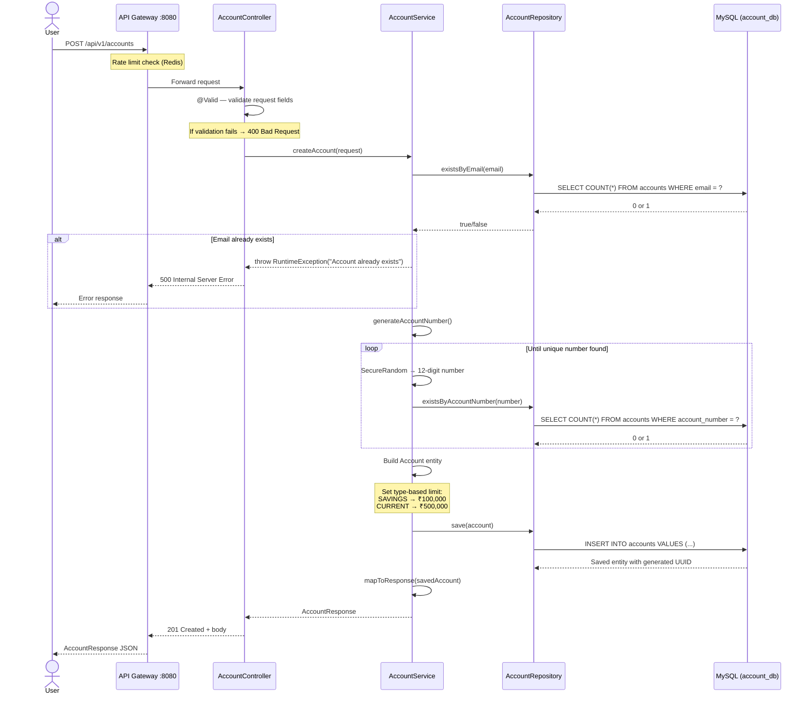
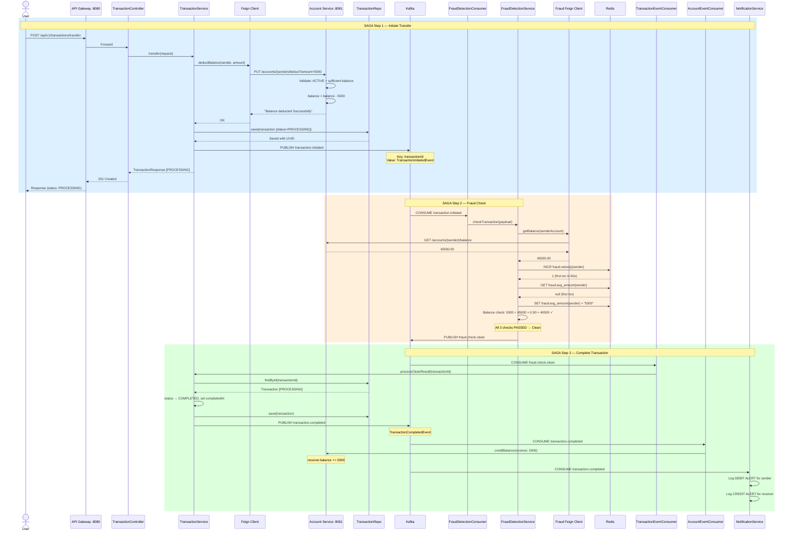
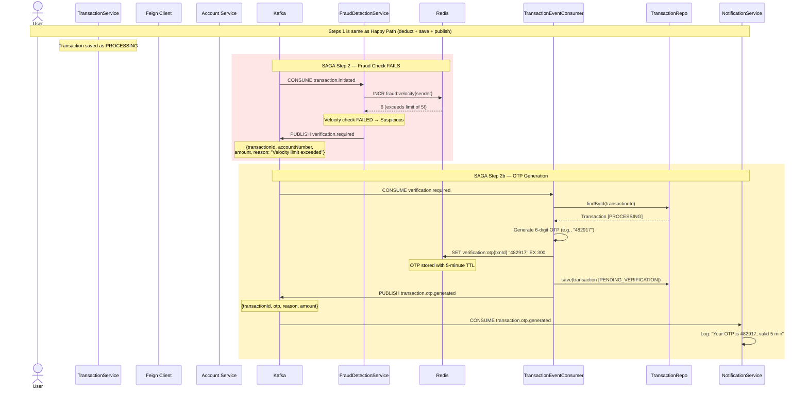
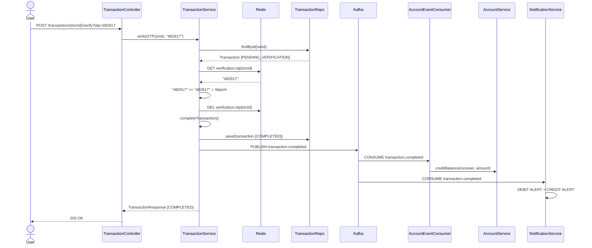
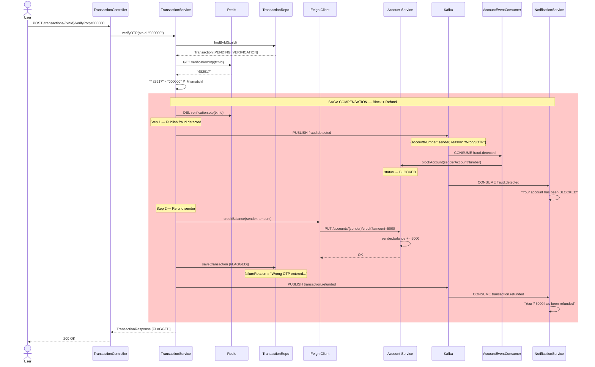
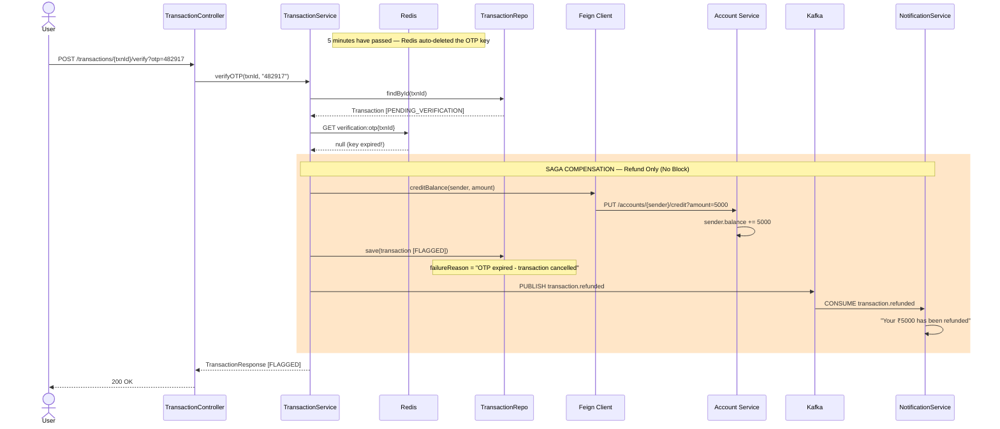
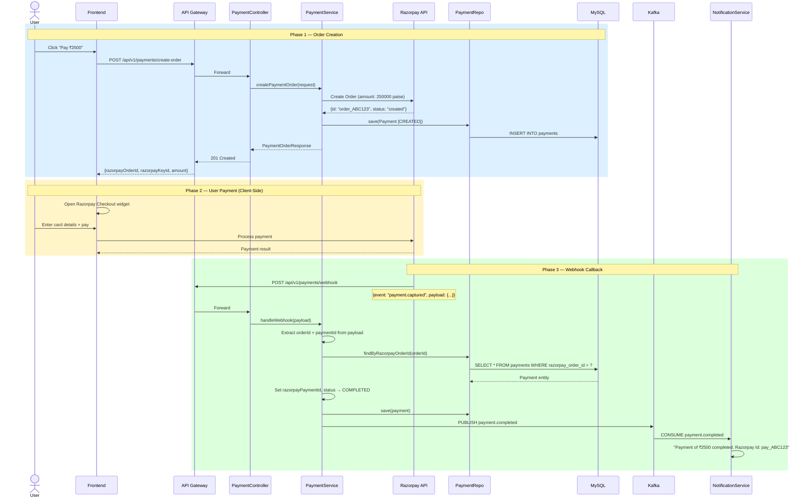
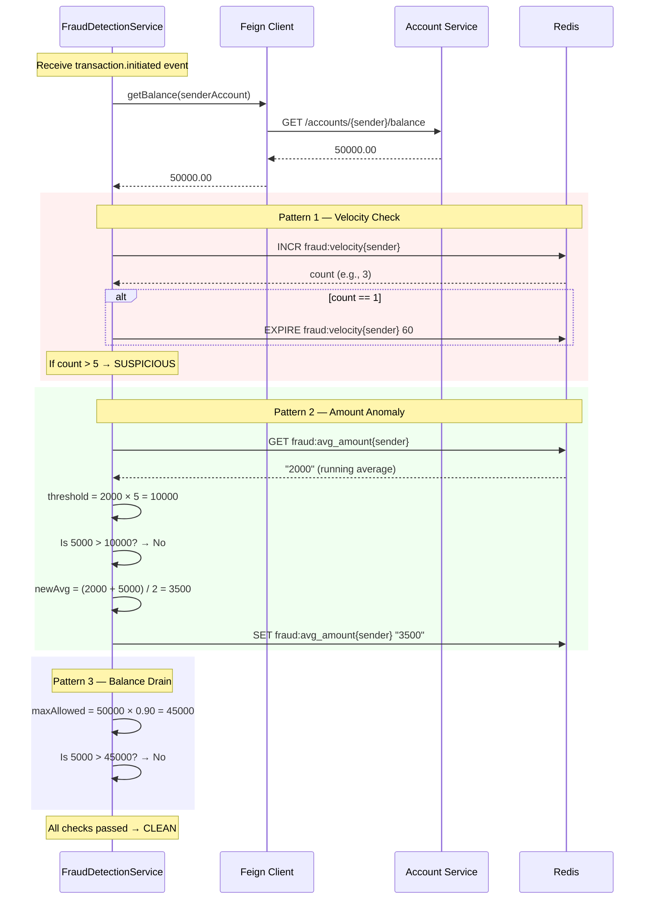

# 05 — Sequence Diagrams

## 5.1 Account Creation Flow



---

## 5.2 Money Transfer — Happy Path (Clean Transaction)

This is the most important flow in the system. The SAGA completes without any fraud detection triggers.



---

## 5.3 Money Transfer — Suspicious Transaction (OTP Verification Required)



---

## 5.4 OTP Verification — Correct OTP



---

## 5.5 OTP Verification — Wrong OTP (SAGA Compensation + Account Block)



---

## 5.6 OTP Verification — OTP Expired (SAGA Compensation, No Block)



---

## 5.7 Payment Flow — Razorpay Integration



---

## 5.8 Fraud Detection — Three Check Patterns



---

## 5.9 Complete Event Timeline — Suspicious Transaction End-to-End

A single timeline showing every event in chronological order for a suspicious transaction with correct OTP verification:

```
T+0s     User sends POST /transfer (₹5000, A → B)
T+0.1s   Account Service deducts ₹5000 from A (Feign)
T+0.2s   Transaction saved [PROCESSING]
T+0.3s   → Kafka: transaction.initiated

T+1s     Fraud Detection receives event
T+1.1s   Fraud Detection fetches A's balance (Feign)
T+1.2s   Velocity check: 6 transactions in 60s > limit 5 → SUSPICIOUS
T+1.3s   → Kafka: verification.required

T+2s     Transaction Service receives verification.required
T+2.1s   OTP "482917" generated
T+2.2s   Redis: SET verification:otp{txnId} "482917" EX 300
T+2.3s   Transaction saved [PENDING_VERIFICATION]
T+2.4s   → Kafka: transaction.otp.generated

T+3s     Notification Service logs OTP alert

T+60s    User submits POST /verify?otp=482917
T+60.1s  Redis: GET verification:otp{txnId} → "482917" (not expired)
T+60.2s  OTP matches → CORRECT
T+60.3s  Redis: DEL verification:otp{txnId}
T+60.4s  Transaction saved [COMPLETED]
T+60.5s  → Kafka: transaction.completed

T+61s    Account Service credits ₹5000 to B
T+61s    Notification Service logs DEBIT + CREDIT alerts

TOTAL TIME: ~61 seconds (mostly user think time)
```
