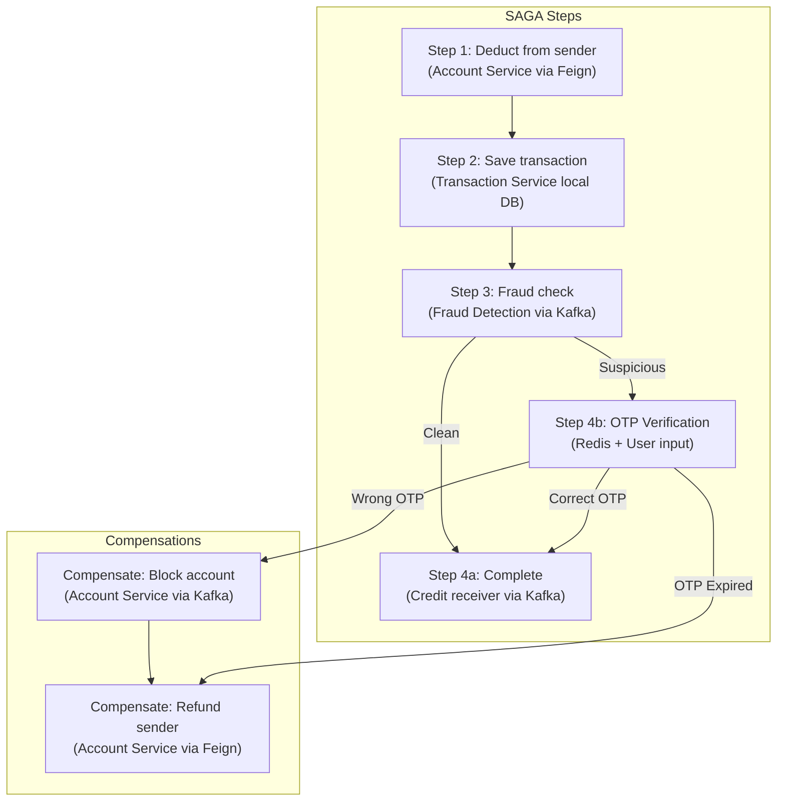
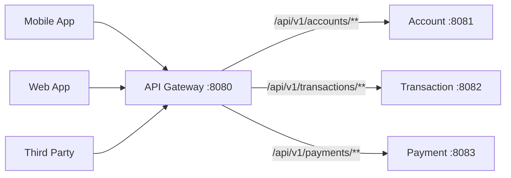
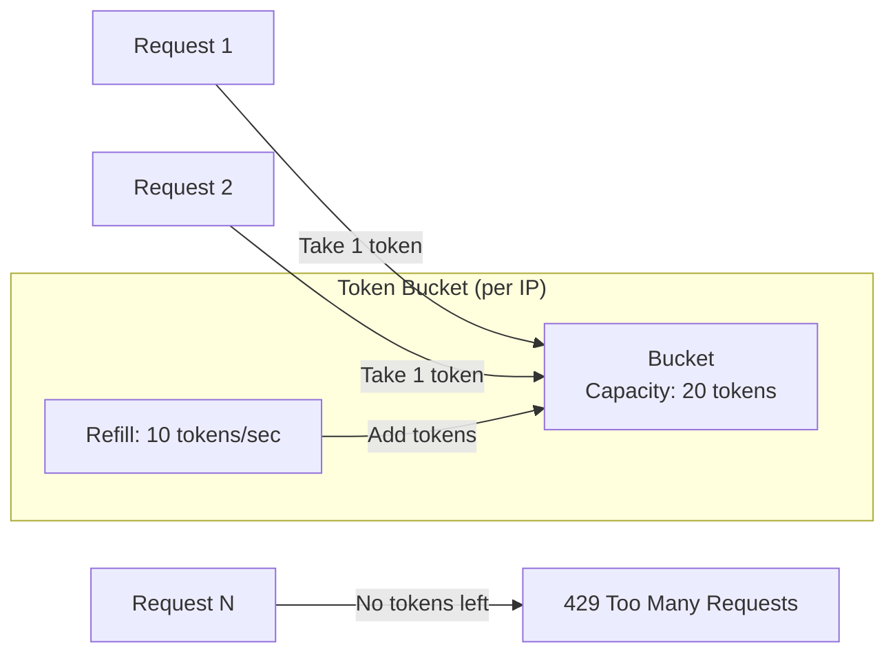
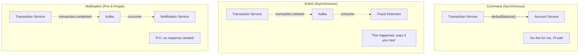
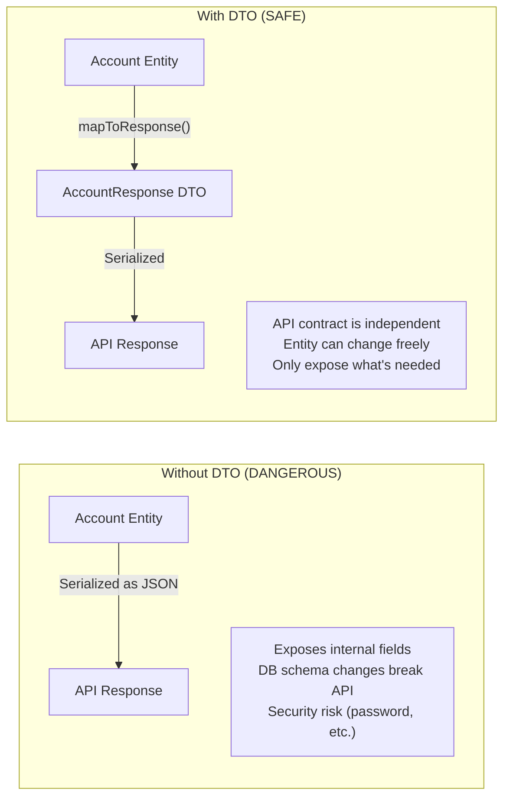
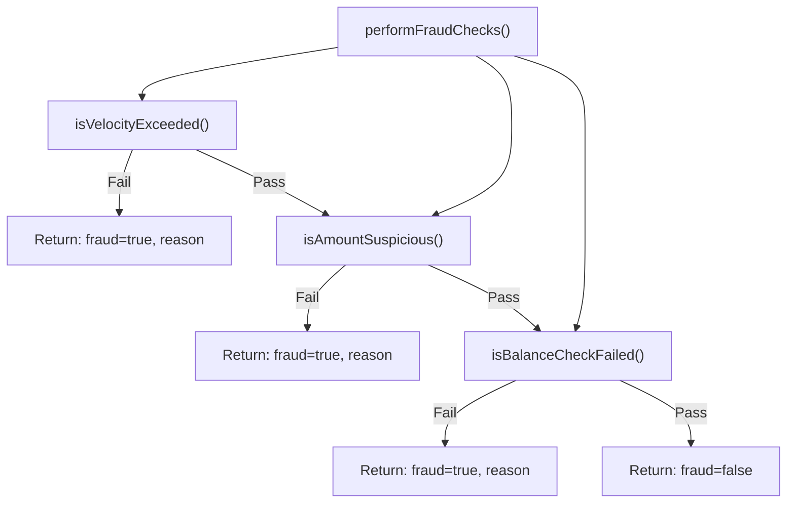
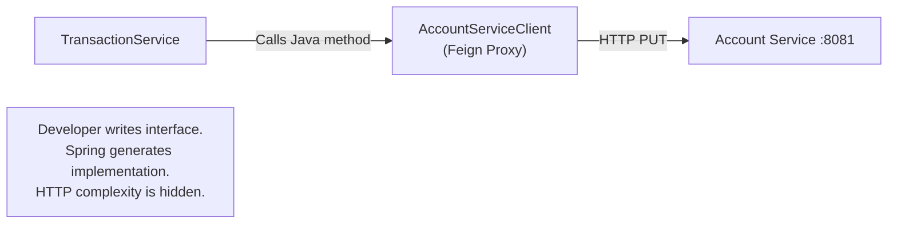
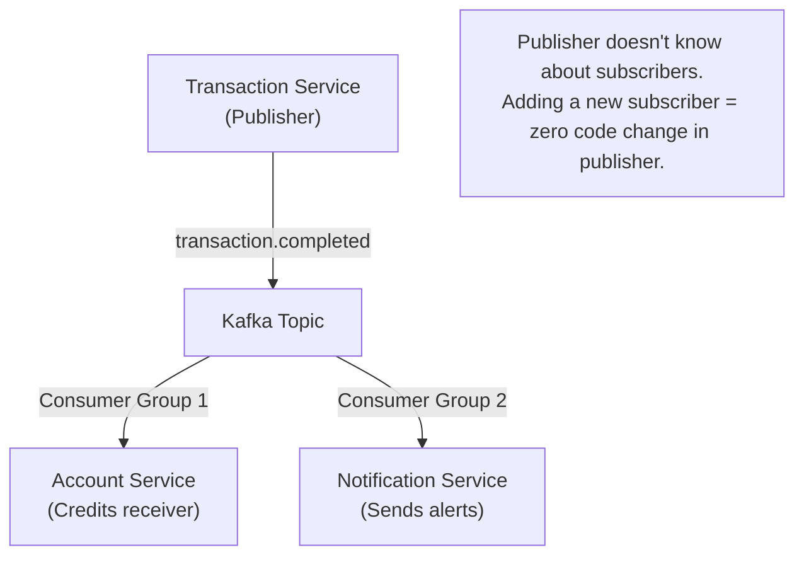

# 06 — Design Patterns

## 6.1 Patterns Used in This System

| Pattern | Where Used | Category |
|---|---|---|
| **SAGA (Choreography)** | Transaction Service | Distributed Transaction |
| **API Gateway** | API Gateway | Structural |
| **Event-Driven Architecture** | All services via Kafka | Architectural |
| **Database per Service** | Each service owns its data | Data Management |
| **Repository Pattern** | All JPA repositories | Data Access |
| **DTO Pattern** | Request/Response objects | Data Transfer |
| **Builder Pattern** | Account entity creation | Creational |
| **Strategy Pattern** | Fraud detection checks | Behavioral |
| **Observer Pattern** | Kafka pub/sub | Behavioral |
| **Proxy Pattern** | Feign clients | Structural |
| **Token Bucket** | API Gateway rate limiter | Rate Limiting |

---

## 6.2 SAGA Pattern — The Core Pattern

### What is SAGA?

A SAGA is a sequence of **local transactions** where each transaction updates data within a single service and publishes events to trigger the next step. If any step fails, **compensating transactions** undo the preceding changes.

### Why Not Distributed Transactions (2PC)?

| 2-Phase Commit (2PC) | SAGA |
|---|---|
| Locks resources across services | No distributed locks |
| Single coordinator = single point of failure | Each service manages its own state |
| Synchronous — all services wait | Asynchronous — non-blocking |
| Poor performance at scale | High throughput |
| Requires XA-compatible databases | Works with any database |

### SAGA in This System — Transfer Flow



### Implementation in Code

```java
// SAGA Step 1 — TransactionService.transfer()
public TransactionResponse transfer(TransferRequest request) {
    // LOCAL TRANSACTION 1: Deduct from sender (sync Feign call)
    accountServiceClient.deductBalance(sender, amount);

    // LOCAL TRANSACTION 2: Save transaction record
    transaction.setStatus(TransactionStatus.PROCESSING);
    transactionRepository.save(transaction);

    // TRIGGER NEXT STEP: Publish event for fraud check
    kafkaTemplate.send("transaction.initiated", event);

    return mapToResponse(transaction);
}

// SAGA COMPENSATION — TransactionService.compensateTransaction()
private void compensateTransaction(Transaction transaction, String reason) {
    // UNDO Step 1: Refund the deducted amount
    accountServiceClient.creditBalance(sender, amount);

    // Mark transaction as FLAGGED (not COMPLETED)
    transaction.setStatus(TransactionStatus.FLAGGED);
    transaction.setFailureReason(reason);
    transactionRepository.save(transaction);

    // Notify about refund
    kafkaTemplate.send("transaction.refunded", refundEvent);
}
```

### SAGA Compensation Matrix

| Failure Point | What Was Done | Compensation Action |
|---|---|---|
| Fraud detected + wrong OTP | Sender balance deducted | Credit sender balance back + block account |
| OTP expired | Sender balance deducted | Credit sender balance back (no block) |
| Feign call to deduct fails | Nothing | No compensation needed (exception thrown to user) |

---

## 6.3 API Gateway Pattern

### What is it?

A single entry point for all client requests that handles cross-cutting concerns.



### Responsibilities in This System

| Responsibility | Implementation |
|---|---|
| **Routing** | Path-based routing in `application.yaml` |
| **Rate Limiting** | Redis-backed token bucket (10/s accounts+txns, 5/s payments) |
| **Health Checks** | Actuator endpoints (`/actuator/health`, `/actuator/gateway`) |

### Responsibilities NOT Yet Implemented (Future)

| Responsibility | Typical Implementation |
|---|---|
| **Authentication** | JWT validation, OAuth2 token check |
| **Load Balancing** | Round-robin across service instances |
| **Circuit Breaking** | Resilience4j / Hystrix fallbacks |
| **Request Logging** | Correlation ID propagation |
| **CORS** | Centralized CORS policy |
| **SSL Termination** | HTTPS → HTTP at gateway |

### Implementation

```yaml
# application.yaml — Declarative routing
spring.cloud.gateway.routes:
  - id: account-service
    uri: http://localhost:8081
    predicates:
      - Path=/api/v1/account/**
    filters:
      - name: RequestRateLimiter
        args:
          redis-rate-limiter.replenishRate: 10  # 10 tokens/second
          redis-rate-limiter.burstCapacity: 20  # Max burst of 20
```

```java
// RateLimiterConfig.java — Key resolver (rate limit by IP)
@Configuration
public class RateLimiterConfig {
    public KeyResolver keyResolver() {
        return exchange -> Mono.just(
            exchange.getRequest()
                .getRemoteAddress()
                .getAddress()
                .getHostAddress()
        );
    }
}
```

### Token Bucket Algorithm (Used by Rate Limiter)



---

## 6.4 Event-Driven Architecture (EDA)

### What is it?

Services communicate by producing and consuming **events** — facts about things that happened — rather than making direct requests.

### Three Types of Communication in This System



### Event Schema Design Principle

Events in this system carry **just enough data** for consumers to act without making additional calls:

```java
// GOOD — Self-contained event
TransactionCompletedEvent {
    transactionId          // identify the transaction
    senderAccountNumber    // for debit notification
    receiverAccountNumber  // for credit action + notification
    amount                 // how much to credit
    description            // for notification message
}

// BAD — Would force consumer to call back
TransactionCompletedEvent {
    transactionId   // Consumer must call GET /transactions/{id} for details
}
```

---

## 6.5 Repository Pattern

### What is it?

An abstraction over data access that makes the data layer look like an in-memory collection.

### Implementation via Spring Data JPA

```java
// Interface declaration — NO implementation code needed
public interface AccountRepository extends JpaRepository<Account, String> {
    boolean existsByEmail(String email);
    boolean existsByAccountNumber(String accountNumber);
    Optional<Account> findByAccountNumber(String accountNumber);
}
```

Spring Data JPA auto-generates the implementation at startup based on method naming conventions:

| Method Name | Generated SQL |
|---|---|
| `existsByEmail(email)` | `SELECT COUNT(*) > 0 FROM accounts WHERE email = ?` |
| `existsByAccountNumber(num)` | `SELECT COUNT(*) > 0 FROM accounts WHERE account_number = ?` |
| `findByAccountNumber(num)` | `SELECT * FROM accounts WHERE account_number = ?` |
| `findBySenderAccountNumberOrderByCreatedAtDesc(num)` | `SELECT * FROM transactions WHERE sender_account_number = ? ORDER BY created_at DESC` |

### Why This Pattern Matters

| Without Repository | With Repository |
|---|---|
| SQL strings scattered in service code | Clean method calls |
| Service knows about JDBC/Hibernate | Service is persistence-agnostic |
| Hard to test (needs real DB) | Easy to mock in unit tests |
| Changing DB engine = rewrite service | Change only repository layer |

---

## 6.6 DTO Pattern (Data Transfer Object)

### What is it?

Separate objects for API input/output that decouple the internal entity structure from the external contract.

### Why Not Return Entities Directly?



### This System's DTO Design

| Entity | Input DTO | Output DTO | Key Difference |
|---|---|---|---|
| `Account` | `CreateAccountRequest` | `AccountResponse` | Input has `initialDeposit`; Output has `balance`, `id`, `createdAt` |
| `Transaction` | `TransferRequest` | `TransactionResponse` | Input has sender+receiver+amount; Output has all status fields |
| `Payment` | `CreatePaymentRequest` | `PaymentOrderResponse` | Input has account+amount; Output has Razorpay IDs |

---

## 6.7 Builder Pattern

### Where Used

Account entity creation in `AccountService.createAccount()`:

```java
Account account = Account.builder()
    .email(request.getEmail())
    .phone(request.getPhone())
    .accountHolderName(request.getAccountHolderName())
    .accountType(request.getAccountType())
    .balance(request.getInitialDeposit())
    .status(AccountStatus.ACTIVE)
    .accountNumber(generateAccountNumber())
    .dailyTransactionLimit(
        request.getAccountType() == AccountType.SAVINGS
            ? new BigDecimal("100000")
            : new BigDecimal("500000")
    )
    .build();
```

### Why Builder Here?

| Alternative | Problem |
|---|---|
| Constructor with 10 parameters | `new Account(null, "482...", "Samarth", "s@e.com", ...)` — unreadable, error-prone |
| Setter chain | Allows creating partially initialized objects (missing required fields) |
| **Builder** | Readable, enforces all fields, immutable after build |

Lombok's `@Builder` annotation generates the builder at compile time — zero boilerplate.

---

## 6.8 Strategy Pattern (Implicit)

### Where Used

The three fraud checks in `FraudDetectionService` follow a Strategy-like pattern:



Currently implemented as **sequential private methods with early return**. In a production system, these would be extracted into a proper Strategy interface for pluggable fraud rules:

```java
// Future improvement — Strategy Pattern
public interface FraudCheckStrategy {
    FraudCheckResult check(String accountNumber, BigDecimal amount, BigDecimal balance);
}

public class VelocityCheckStrategy implements FraudCheckStrategy { ... }
public class AmountAnomalyStrategy implements FraudCheckStrategy { ... }
public class BalanceDrainStrategy implements FraudCheckStrategy { ... }
```

---

## 6.9 Proxy Pattern (Feign Clients)

### What is it?

Feign creates a **proxy** that implements the interface at runtime, hiding all HTTP client complexity.



### What Feign Does Behind the Scenes

When you call `accountServiceClient.deductBalance("482917", BigDecimal.valueOf(5000))`, Feign:

1. Resolves `url` from `application.yaml` → `http://localhost:8081`
2. Builds HTTP request: `PUT /api/v1/accounts/482917/deduct?amount=5000`
3. Serializes parameters
4. Sends HTTP request
5. Deserializes response
6. Returns result (or throws exception on 4xx/5xx)

---

## 6.10 Observer Pattern (Kafka Pub/Sub)

### What is it?

**Publishers** emit events without knowing who's listening. **Subscribers** react to events without knowing who published them.



### Extensibility Advantage

Want to add an **Analytics Service** that tracks transaction volumes? Just add a new consumer:

```java
@KafkaListener(topics = "transaction.completed", groupId = "analytics-group")
public void consumeTransactionCompleted(Map<String, Object> payload) {
    // Track metrics, update dashboards
}
```

**Zero changes** to Transaction Service, Account Service, or Notification Service.
