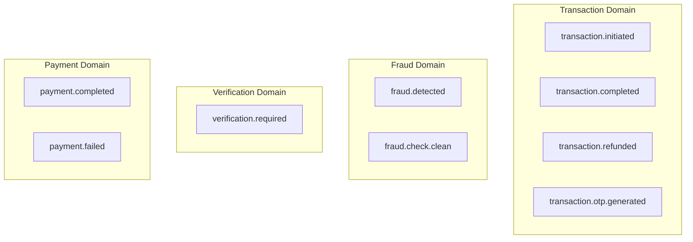
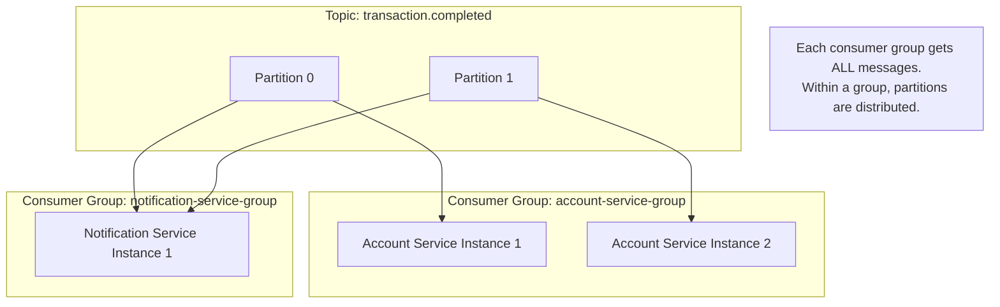
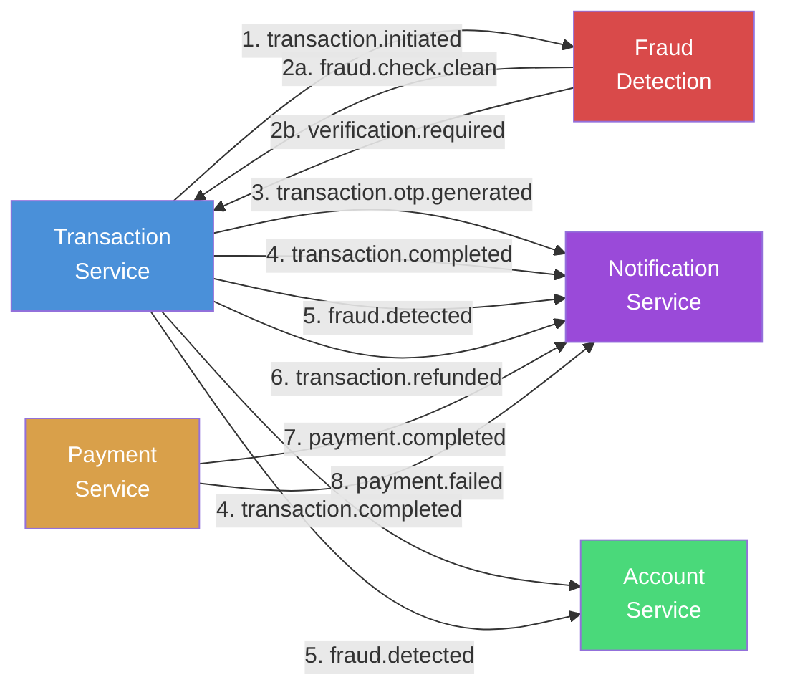

# 07 — Kafka Event Design

## 7.1 Topic Taxonomy

This system uses **9 Kafka topics** organized by domain and action:



### Naming Convention

The topic naming follows `{domain}.{action}` or `{domain}.{sub-domain}.{action}`:

| Pattern | Examples |
|---|---|
| `{domain}.{action}` | `transaction.initiated`, `transaction.completed`, `payment.completed` |
| `{domain}.{sub-domain}.{action}` | `transaction.otp.generated`, `fraud.check.clean` |

---

## 7.2 Complete Topic Reference

### `transaction.initiated`

| Property | Value |
|---|---|
| **Publisher** | Transaction Service |
| **Consumers** | Fraud Detection Service (`fraud-detection-group`) |
| **Trigger** | Transfer request initiated, sender deducted |
| **Key** | `transactionId` (String) |
| **Purpose** | Triggers fraud analysis on the new transaction |

**Event Schema:**
```json
{
    "transactionId": "f7e8d9c0-b1a2-3456-...",
    "senderAccountNumber": "482917365014",
    "receiverAccountNumber": "719283650471",
    "amount": 5000.00,
    "description": "Rent payment"
}
```

**Java Type:** `TransactionInitiatedEvent` (typed POJO)

---

### `fraud.check.clean`

| Property | Value |
|---|---|
| **Publisher** | Fraud Detection Service |
| **Consumers** | Transaction Service (`transaction-service-group`) |
| **Trigger** | All 3 fraud checks passed |
| **Key** | `transactionId` |
| **Purpose** | Signals Transaction Service to complete the transfer |

**Event Schema:**
```json
{
    "transactionId": "f7e8d9c0-b1a2-3456-...",
    "fraud": false,
    "reason": null
}
```

**Java Type:** `Map<String, Object>` (untyped)

---

### `verification.required`

| Property | Value |
|---|---|
| **Publisher** | Fraud Detection Service |
| **Consumers** | Transaction Service (`transaction-service-group`) |
| **Trigger** | Any fraud check pattern matched |
| **Key** | `transactionId` |
| **Purpose** | Triggers OTP generation and user verification flow |

**Event Schema:**
```json
{
    "transactionId": "f7e8d9c0-b1a2-3456-...",
    "accountNumber": "482917365014",
    "amount": 5000.00,
    "reason": "Too many transactions in 60 seconds - Velocity limit exceeded"
}
```

---

### `transaction.otp.generated`

| Property | Value |
|---|---|
| **Publisher** | Transaction Service (TransactionEventConsumer) |
| **Consumers** | Notification Service (`notification-service-group`) |
| **Trigger** | OTP generated and stored in Redis |
| **Key** | `transactionId` |
| **Purpose** | Notify user of the OTP for verification |

**Event Schema:**
```json
{
    "transactionId": "f7e8d9c0-b1a2-3456-...",
    "accountNumber": "482917365014",
    "reason": "Velocity limit exceeded",
    "otp": "482917",
    "amount": 5000.00
}
```

> **Security Note:** The OTP is included in this event. In production, the OTP should be sent via a secure channel (SMS/email) and NOT logged.

---

### `transaction.completed`

| Property | Value |
|---|---|
| **Publisher** | Transaction Service |
| **Consumers** | Account Service (`account-service-group`), Notification Service (`notification-service-group`) |
| **Trigger** | Transaction completes (clean check or correct OTP) |
| **Key** | `transactionId` |
| **Purpose** | Credits receiver account + sends debit/credit notifications |

**Event Schema:**
```json
{
    "transactionId": "f7e8d9c0-b1a2-3456-...",
    "senderAccountNumber": "482917365014",
    "receiverAccountNumber": "719283650471",
    "amount": 5000.00,
    "description": "Rent payment"
}
```

**Java Type:** `TransactionCompletedEvent` (typed POJO)

**Note:** This topic has **2 consumer groups** — each consumer processes independently:
- Account Service credits the receiver's balance
- Notification Service sends debit + credit alerts

---

### `fraud.detected`

| Property | Value |
|---|---|
| **Publisher** | Transaction Service |
| **Consumers** | Account Service (`account-service-group`), Notification Service (`notification-service-group`) |
| **Trigger** | Wrong OTP entered during verification |
| **Key** | `senderAccountNumber` |
| **Purpose** | Blocks the sender's account + alerts user |

**Event Schema:**
```json
{
    "transactionId": "f7e8d9c0-b1a2-3456-...",
    "accountNumber": "482917365014",
    "reason": "Wrong OTP entered - transaction cancelled, account blocking for security"
}
```

---

### `transaction.refunded`

| Property | Value |
|---|---|
| **Publisher** | Transaction Service |
| **Consumers** | Notification Service (`notification-service-group`) |
| **Trigger** | SAGA compensation executed (wrong OTP or expired OTP) |
| **Key** | `transactionId` |
| **Purpose** | Notify user that their money was refunded |

**Event Schema:**
```json
{
    "transactionId": "f7e8d9c0-b1a2-3456-...",
    "senderAccountNumber": "482917365014",
    "amount": 5000.00,
    "reason": "OTP expired - transaction cancelled and amount refunded"
}
```

---

### `payment.completed`

| Property | Value |
|---|---|
| **Publisher** | Payment Service |
| **Consumers** | Notification Service (`notification-service-group`) |
| **Trigger** | Razorpay webhook: `payment.captured` |
| **Key** | `paymentId` |
| **Purpose** | Notify user of successful payment |

**Event Schema:**
```json
{
    "paymentId": "p1a2b3c4-d5e6-...",
    "accountNumber": "482917365014",
    "amount": 2500.00,
    "razorpayPaymentId": "pay_ABC123XYZ"
}
```

---

### `payment.failed`

| Property | Value |
|---|---|
| **Publisher** | Payment Service |
| **Consumers** | Notification Service (`notification-service-group`) |
| **Trigger** | Razorpay webhook: `payment.failed` |
| **Key** | `paymentId` |
| **Purpose** | Notify user of failed payment |

**Event Schema:**
```json
{
    "paymentId": "p1a2b3c4-d5e6-...",
    "accountNumber": "482917365014",
    "amount": 2500.00,
    "reason": "Payment failed by Razorpay"
}
```

---

## 7.3 Consumer Groups

Consumer groups determine how Kafka delivers messages across service instances.

| Consumer Group | Service | Subscribed Topics |
|---|---|---|
| `fraud-detection-group` | Fraud Detection | `transaction.initiated` |
| `transaction-service-group` | Transaction Service | `verification.required`, `fraud.check.clean` |
| `account-service-group` | Account Service | `transaction.completed`, `fraud.detected` |
| `notification-service-group` | Notification Service | `transaction.otp.generated`, `transaction.completed`, `fraud.detected`, `transaction.refunded`, `payment.completed`, `payment.failed` |

### How Consumer Groups Work



**Key Insight:** When Account Service and Notification Service both consume `transaction.completed`, they are in **different consumer groups**. Each group independently receives every message. Within a group, if you scale to multiple instances, partitions are distributed.

---

## 7.4 Serialization Configuration

All services use the same serialization strategy:

### Producer Config
```yaml
spring.kafka.producer:
  key-serializer: org.apache.kafka.common.serialization.StringSerializer
  value-serializer: org.springframework.kafka.support.serializer.JsonSerializer
```

### Consumer Config
```yaml
spring.kafka.consumer:
  key-deserializer: org.apache.kafka.common.serialization.StringDeserializer
  value-deserializer: org.springframework.kafka.support.serializer.JsonDeserializer
  properties:
    spring.json.trusted.packages: "*"           # Trust all packages
    spring.json.use.type.headers: false          # Don't use Java type headers
    spring.json.value.default.type: java.util.HashMap  # Deserialize as Map
```

### Design Decision: `Map<String, Object>` vs Typed POJOs

| Approach | Pros | Cons |
|---|---|---|
| **`Map<String, Object>`** (used by most consumers) | No shared library needed; loose coupling | No compile-time safety; runtime casting |
| **Typed POJO** (used by `TransactionInitiatedEvent`) | Type safety; IDE autocomplete | Requires shared event library or duplicated classes |

This system uses a hybrid approach — typed POJOs for publishing (clear structure) and `Map<String, Object>` for consuming (maximum decoupling).

---

## 7.5 Message Key Strategy

Every Kafka message has a **key** that determines which partition receives it.

| Topic | Message Key | Why |
|---|---|---|
| `transaction.initiated` | `transactionId` | All events for same transaction go to same partition → ordering |
| `transaction.completed` | `transactionId` | Ensures ordered processing per transaction |
| `fraud.detected` | `senderAccountNumber` | All fraud events for same account are processed sequentially |
| `payment.completed` | `paymentId` | Payment events for same payment stay ordered |

### Why Keys Matter

```
Without key: Messages distributed round-robin across partitions → NO ordering guarantee
With key:    All messages with same key → SAME partition → GUARANTEED ordering
```

For banking, ordering is critical. You don't want a "transaction.completed" event processed before the "transaction.initiated" event.

---

## 7.6 Event Flow Diagram (All 9 Topics)



### Event Frequency in a Typical Transfer

| Scenario | Events Published | Topics Used |
|---|---|---|
| Clean transfer | 2 | `transaction.initiated` → `fraud.check.clean` → `transaction.completed` |
| Suspicious + correct OTP | 4 | `transaction.initiated` → `verification.required` → `transaction.otp.generated` → `transaction.completed` |
| Suspicious + wrong OTP | 5 | `transaction.initiated` → `verification.required` → `transaction.otp.generated` → `fraud.detected` → `transaction.refunded` |
| Suspicious + OTP expired | 3 | `transaction.initiated` → `verification.required` → `transaction.otp.generated` → `transaction.refunded` |
