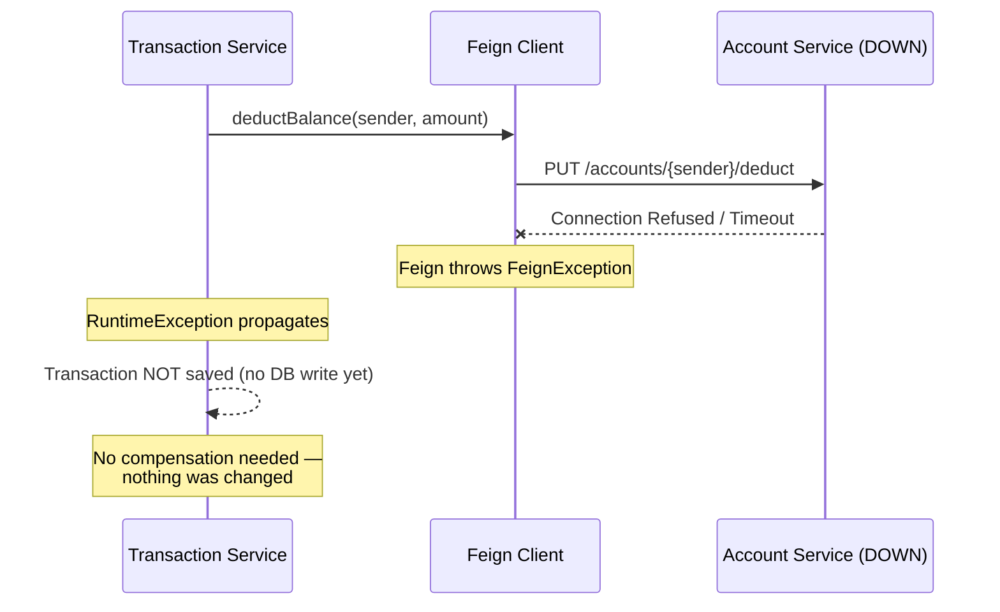
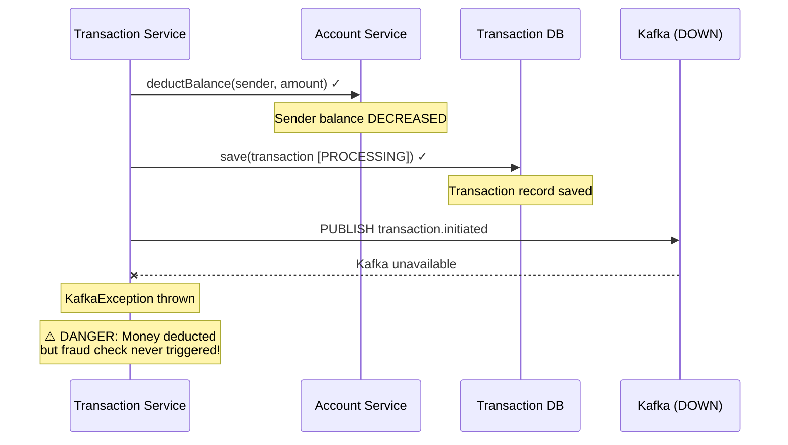
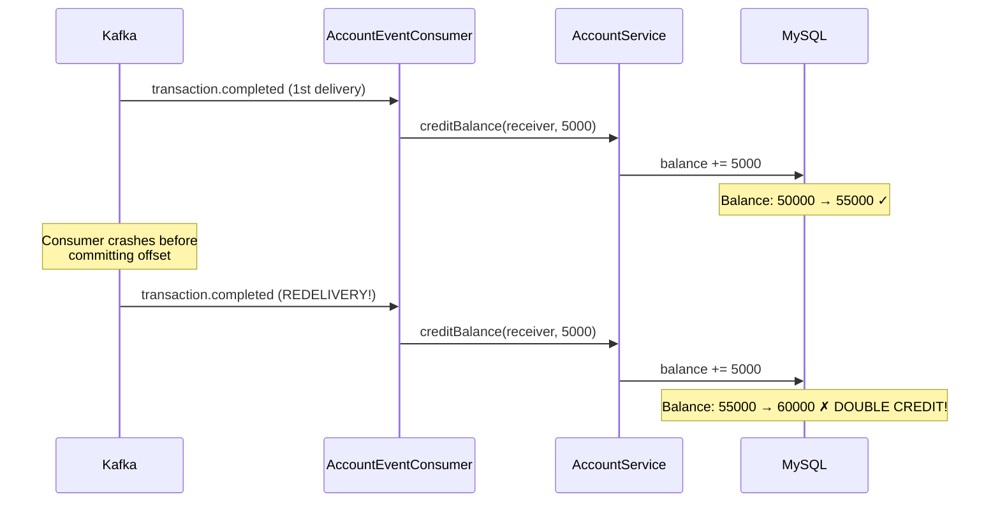
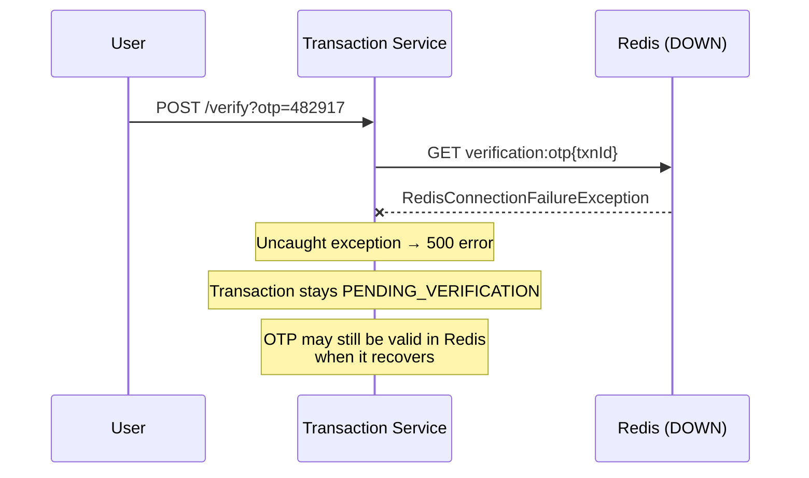
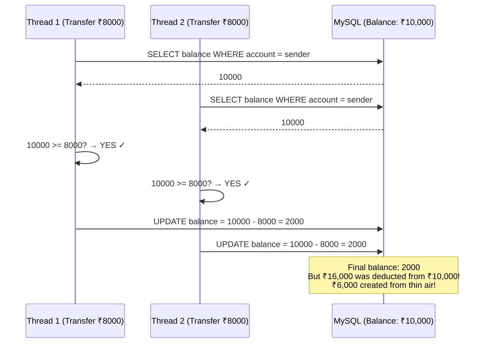

# 08 — Error Handling & Edge Cases

## 8.1 Error Handling Philosophy

In a microservices banking system, errors are **inevitable**. The system must handle them gracefully — never lose money, always leave data in a consistent state, and always inform the user.

### Error Categories

| Category | Example | Handling Strategy |
|---|---|---|
| **Validation Errors** | Missing email, negative amount | Reject at controller level (400) |
| **Business Logic Errors** | Insufficient balance, duplicate email | Throw RuntimeException (500) |
| **Infrastructure Failures** | DB down, Kafka unavailable, Redis timeout | Retry or fail gracefully |
| **Inter-Service Failures** | Feign timeout, target service down | SAGA compensation |
| **Data Consistency Issues** | Deducted but not credited, double processing | Idempotency + compensation |

---

## 8.2 Failure Scenarios & Recovery

### Scenario 1: Account Service Down During Transfer



**Result:** User gets a 500 error. No money was moved. No data inconsistency.

**Why it's safe:** The Feign call to deduct happens BEFORE saving the transaction. If it fails, the method exits early.

---

### Scenario 2: Kafka Down After Deduction



**Current Risk:** The transaction is stuck in `PROCESSING` forever. The sender's money is deducted but the receiver never gets credited.

**Missing Safeguard (Should Implement):**
1. **Transactional Outbox Pattern** — Save event to DB first, then reliably publish to Kafka
2. **Scheduled Cleanup Job** — Periodically scan for `PROCESSING` transactions older than X minutes and compensate

---

### Scenario 3: Duplicate Kafka Message Processing



**Current Risk:** The system is NOT idempotent. If Kafka redelivers a message, the receiver gets double money.

**Missing Safeguard (Should Implement):**
```java
// Idempotency check — before crediting
public void creditBalance(String accountNumber, BigDecimal amount, String transactionId) {
    // Check if this transaction was already processed
    if (processedTransactions.contains(transactionId)) {
        log.warn("Duplicate credit attempt for transaction: {}", transactionId);
        return;
    }
    // ... proceed with credit
    processedTransactions.add(transactionId);
}
```

---

### Scenario 4: Redis Down During OTP Verification



**Current Risk:** Unhandled Redis exception crashes the request. User can retry when Redis recovers.

**Missing Safeguard (Should Implement):**
```java
try {
    storedOTP = redisTemplate.opsForValue().get(otpKey);
} catch (RedisConnectionFailureException e) {
    log.error("Redis unavailable during OTP verification");
    throw new ServiceUnavailableException("Verification temporarily unavailable. Please retry.");
}
```

---

### Scenario 5: Race Condition — Concurrent Deductions



**Current Risk:** No pessimistic or optimistic locking. Concurrent transfers from the same account can overdraw.

**Missing Safeguard (Should Implement):**

Option A — **Pessimistic Locking:**
```java
@Lock(LockModeType.PESSIMISTIC_WRITE)
@Query("SELECT a FROM Account a WHERE a.accountNumber = :accountNumber")
Optional<Account> findByAccountNumberForUpdate(@Param("accountNumber") String accountNumber);
```

Option B — **Optimistic Locking:**
```java
@Entity
public class Account {
    @Version
    private Long version;  // Hibernate checks version on update
}
```

Option C — **Database-Level Atomic Update:**
```sql
UPDATE accounts
SET balance = balance - 8000
WHERE account_number = '482917365014'
  AND balance >= 8000;
-- If affected rows = 0 → insufficient balance (atomic check)
```

---

## 8.3 Current Error Handling Implementation

### Controller Level — Validation

```java
@PostMapping
public ResponseEntity<AccountResponse> createAccount(
        @Valid @RequestBody CreateAccountRequest request) {
    // @Valid triggers Jakarta Bean Validation
    // If validation fails → Spring returns 400 + error details automatically
    return ResponseEntity.status(HttpStatus.CREATED)
            .body(accountService.createAccount(request));
}
```

### Service Level — Business Errors

```java
// Pattern used throughout the codebase
Account account = accountRepository.findByAccountNumber(accountNumber)
        .orElseThrow(() -> new RuntimeException("Account not found"));

if (account.getStatus() != AccountStatus.ACTIVE) {
    throw new RuntimeException("Account not active");
}

if (account.getBalance().compareTo(amount) < 0) {
    throw new RuntimeException("Insufficient balance");
}
```

**Limitation:** All errors throw generic `RuntimeException` which returns as `500 Internal Server Error`. In production, should use custom exceptions with `@ControllerAdvice`:

```java
// Recommended improvement
@ResponseStatus(HttpStatus.NOT_FOUND)
public class AccountNotFoundException extends RuntimeException {
    public AccountNotFoundException(String accountNumber) {
        super("Account not found: " + accountNumber);
    }
}

@ResponseStatus(HttpStatus.CONFLICT)
public class DuplicateAccountException extends RuntimeException { ... }

@ResponseStatus(HttpStatus.BAD_REQUEST)
public class InsufficientBalanceException extends RuntimeException { ... }
```

### Kafka Consumer Level — Try-Catch Wrapping

```java
@KafkaListener(topics = "transaction.completed")
public void consumeTransactionCompleted(@Payload Map<String, Object> payload) {
    try {
        // Process event
        String receiverAccount = (String) payload.get("receiverAccountNumber");
        BigDecimal amount = new BigDecimal(payload.get("amount").toString());
        accountService.creditBalance(receiverAccount, amount);
    } catch (Exception e) {
        log.error("Error while credited account: {}", e.getMessage());
        // Event is consumed (offset committed) — NOT retried
    }
}
```

**Current Behavior:** Errors are logged and swallowed. The Kafka offset is committed, meaning the failed message is NOT reprocessed.

**Missing Safeguard:** Should implement a Dead Letter Queue (DLQ):
```java
// Failed messages go to a DLQ topic for manual review
@KafkaListener(topics = "transaction.completed")
@RetryableTopic(
    attempts = "3",
    backoff = @Backoff(delay = 1000, multiplier = 2),
    dltTopicSuffix = ".DLQ"
)
public void consumeTransactionCompleted(...) { ... }
```

---

## 8.4 Edge Cases Catalog

### Account Service Edge Cases

| Edge Case | Current Handling | Impact |
|---|---|---|
| Create account with duplicate email | `RuntimeException("Account already exists")` | Returns 500 (should be 409 Conflict) |
| Deduct from BLOCKED account | `RuntimeException("Account not active")` | Correctly prevents deduction |
| Deduct more than balance | `RuntimeException("Insufficient balance")` | Correctly prevents overdraw |
| Credit to non-existent account | `RuntimeException("Account not found")` | Receiver credit fails; money stuck in limbo |
| Account number collision during generation | Retry loop with `existsByAccountNumber()` | Handled correctly |

### Transaction Service Edge Cases

| Edge Case | Current Handling | Impact |
|---|---|---|
| Transfer to self (sender == receiver) | Not validated | User can transfer to themselves (deduct then credit same account) |
| Transfer with amount = 0 | `@Positive` validation rejects | Correctly prevented |
| Verify OTP for already COMPLETED transaction | Transaction fetched, OTP checked | Could attempt double-completion |
| Verify OTP for FLAGGED transaction | No status check before OTP verification | Could attempt recovery of flagged transaction |
| Two concurrent verifications for same transaction | No locking on verification flow | Race condition possible |

### Fraud Detection Edge Cases

| Edge Case | Current Handling | Impact |
|---|---|---|
| First transaction ever (no average) | Sets average = current amount, returns clean | Correct — no baseline to compare against |
| Redis down during velocity check | `INCR` throws exception, caught in consumer | Transaction fraud check fails; no clean/suspicious result published |
| Very large amount on first transaction | No average to compare against, only balance check | May pass if < 90% of balance |
| Exactly at threshold (e.g., 5 txns/min) | `count > maxTransactionsPerMinute` (strictly greater) | 5th transaction passes, 6th triggers |

### Payment Service Edge Cases

| Edge Case | Current Handling | Impact |
|---|---|---|
| Razorpay API timeout | `RazorpayException` thrown | User gets error, no payment created |
| Webhook called before order is in DB | `findByRazorpayOrderId()` throws RuntimeException | Webhook processing fails; payment stuck |
| Duplicate webhook for same payment | Payment updated to COMPLETED again | Harmless (idempotent status update) |
| Webhook with unknown `order_id` | RuntimeException | Silently fails, logged as error |

---

## 8.5 Recommended Improvements Summary

| Area | Current State | Recommended Improvement | Priority |
|---|---|---|---|
| **Error Responses** | Generic `RuntimeException` → 500 | Custom exceptions + `@ControllerAdvice` → proper HTTP codes | High |
| **Idempotency** | No duplicate processing check | Idempotency keys for Kafka consumers | High |
| **Concurrency** | No locking on balance operations | Pessimistic locking or atomic DB updates | Critical |
| **Kafka Reliability** | Errors swallowed in consumers | Dead Letter Queue (DLQ) + retry policy | High |
| **Transactional Outbox** | Direct Kafka publish after DB write | Outbox table + polling publisher | Medium |
| **Circuit Breaking** | No fallbacks for Feign calls | Resilience4j circuit breaker | Medium |
| **Input Validation** | No self-transfer check | Validate sender ≠ receiver | Low |
| **Status Checks** | No status guard on OTP verification | Check `PENDING_VERIFICATION` before processing | Medium |
| **Gateway Route** | `/api/v1/account/**` vs `/api/v1/accounts` | Fix route predicate to match controller path | Critical |
| **Redis Resilience** | No fallback when Redis is down | Graceful degradation with retry | Medium |

---

## 8.6 Data Consistency Guarantees

| Operation | Consistency Level | Guarantee |
|---|---|---|
| Account creation | **Strong** (single DB write) | Either fully created or not at all |
| Balance deduction | **Strong** (single DB write) | Atomic within Account Service |
| Transfer (end-to-end) | **Eventual** (SAGA across services) | May be temporarily inconsistent; SAGA compensates |
| Receiver credit | **Eventual** (Kafka consumer) | Processed asynchronously; delay possible |
| OTP verification | **Eventual** (Redis TTL-based) | OTP expires after 5 min regardless of outcome |
| Payment processing | **Eventual** (webhook-based) | Depends on Razorpay webhook delivery |

### The CAP Theorem Trade-off

This system chooses **AP (Availability + Partition Tolerance)** over **CP (Consistency + Partition Tolerance)**:

- During a Kafka partition, services continue operating independently
- Eventual consistency is accepted — a transfer may show `PROCESSING` for seconds/minutes before becoming `COMPLETED`
- SAGA compensation ensures that inconsistencies are eventually resolved
- No distributed locks or 2-phase commits

This is the standard trade-off for microservice banking systems. Traditional monolithic banks choose CP, but modern digital banks (Monzo, Revolut, Nubank) use AP with strong compensation mechanisms.
